## 1번 문제

### 정답: C

Amazon S3 Standard 스토리지에 태그가 있는 개별 파일을 저장합니다. 각 아카이브에 대한 검색 메타데이터를 Amazon S3 Standard 스토리지에 저장합니다. S3 Lifecycle 정책을 사용하여 1년 후 파일을 S3 Glacier Instant Retrieval로 이동합니다. Amazon S3에서 메타데이터를 검색하여 파일을 쿼리하고 검색합니다.

### 풀이 근거

**요구사항 분석:**
- 1년 이내: 무작위로 빈번한 액세스, 가능한 한 빠른 쿼리/검색 필요
- 1년 이후: 드문 액세스, 검색 지연 허용 가능
- 비용 효율적인 솔루션 필요

**정답(C) 근거:**
1. **1년 이내 데이터**: S3 Standard에 저장하여 밀리초 단위 즉시 액세스 가능
2. **메타데이터**: S3 Standard에 유지하여 항상 빠른 검색과 쿼리 가능
3. **1년 후 데이터**: S3 Glacier Instant Retrieval로 자동 전환
   - 밀리초 단위 검색 시간 유지 (아카이빙되지 않음)
   - S3 Standard-IA 대비 최대 68% 비용 절약
4. **Lifecycle 정책**: 자동화된 비용 최적화

**다른 선택지가 틀린 이유:**
- **A**: 처음부터 Glacier Instant Retrieval 사용은 1년 이내 자주 액세스하는 데이터에 비효율적
- **B**: Glacier Flexible Retrieval은 아카이빙되어 복원 필요, Athena는 아카이빙된 데이터 직접 쿼리 불가
- **D**: Glacier Deep Archive는 복원에 12-48시간 소요, 1년 후에도 너무 느림

### 참고한 AWS 공식 문서

1. **[Understanding and managing Amazon S3 storage classes](https://docs.aws.amazon.com/AmazonS3/latest/userguide/storage-class-intro.html)**
   - S3 스토리지 클래스 개요 및 선택 기준

2. **[Understanding S3 Glacier storage classes for long-term data storage](https://docs.aws.amazon.com/AmazonS3/latest/userguide/glacier-storage-classes.html)**
   - S3 Glacier 스토리지 클래스별 특성 비교표
   - Glacier Instant Retrieval: 90일 최소 보관, 밀리초 검색, 분기별 액세스 권장

3. **[Query restored Amazon S3 Glacier objects](https://docs.aws.amazon.com/athena/latest/ug/querying-glacier.html)**
   - Athena는 아카이빙된 Glacier 데이터 직접 쿼리 불가 (복원 필요)

4. **[Amazon S3 Glacier Instant Retrieval Storage Class Announcement](https://aws.amazon.com/about-aws/whats-new/2021/11/amazon-s3-glacier-instant-retrieval-storage-class/)**
   - S3 Standard-IA 대비 최대 68% 비용 절약
   - 밀리초 단위 검색 시간

### S3 스토리지 클래스 전환 플로우

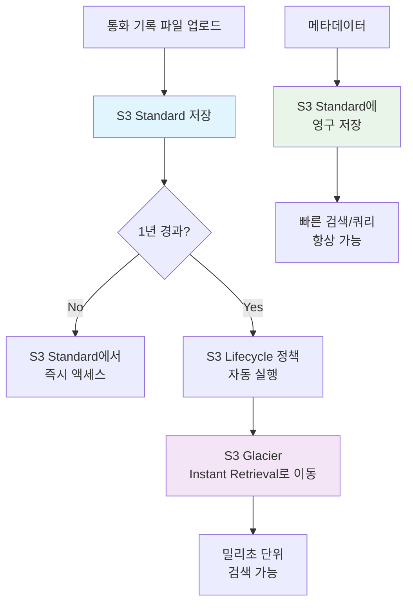

### S3 Glacier 스토리지 클래스 비교

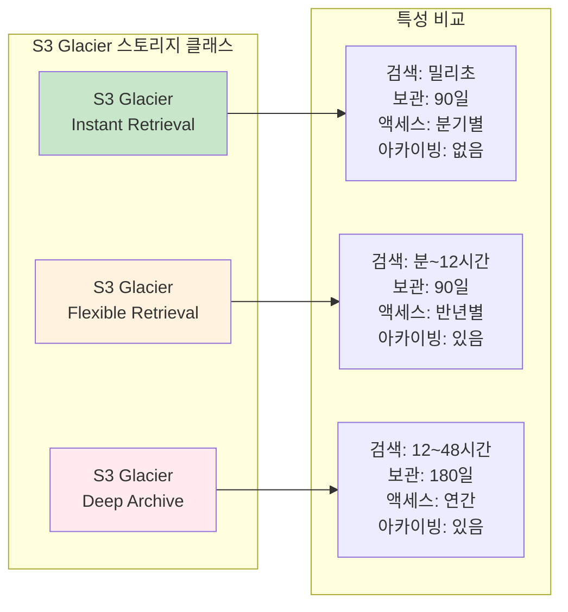

### 비용 및 성능 최적화 관계

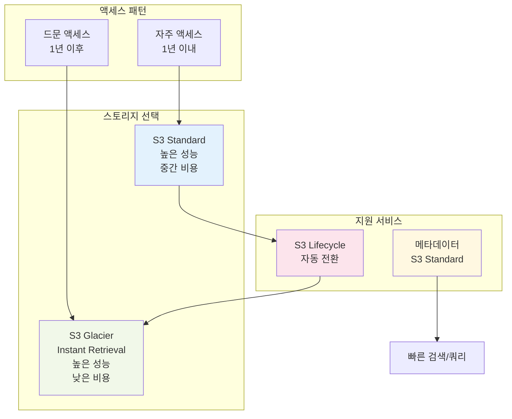

## 2번 문제

### 정답: A, B

**A.** Amazon Simple Queue Service(Amazon SQS) 대기열을 만듭니다. 이미지가 S3 버킷에 업로드되면 SQS 대기열에 알림을 보내도록 S3 버킷을 구성합니다.

**B.** Lambda 함수를 구성하여 Amazon Simple Queue Service(Amazon SQS) 대기열을 호출 소스로 사용합니다. SQS 메시지가 성공적으로 처리되면 대기열에서 메시지를 삭제합니다.

### 풀이 근거

**요구사항 분석:**
- 내구성이 뛰어난 솔루션 (메시지 손실 방지)
- 상태 없는(stateless) 구성 요소 사용
- 이미지 자동 처리 (사용자 개입 없이)
- 마이크로서비스 아키텍처

**정답(A,B) 근거:**
1. **S3 → SQS → Lambda 아키텍처**
   - S3 이벤트 알림: SQS, SNS, Lambda 직접 지원
   - SQS: 내구성 있는 메시지 큐 서비스로 메시지 지속성 보장
   - Lambda: 완전한 상태 없는 서버리스 컴퓨팅

2. **SQS의 내구성 특성**
   - 메시지 지속성과 자동 재시도 메커니즘
   - Lambda 함수 실패 시에도 메시지 보존
   - Visibility timeout을 통한 안전한 메시지 처리
   - 배치 처리로 효율성 향상

3. **Lambda + SQS 통합 방식**
   - Lambda가 SQS를 이벤트 소스로 폴링
   - 성공적 처리 시 Lambda가 자동으로 메시지 삭제
   - 실패 시 visibility timeout 후 자동 재처리
   - 중복 처리를 위한 idempotent 설계 권장

**다른 선택지가 틀린 이유:**
- **C**: Lambda가 메모리에 텍스트 파일 작성은 상태를 유지하므로 stateless 요구사항 위반
- **D**: EC2 인스턴스 사용은 서버리스가 아니며 관리 오버헤드 발생, stateless 위반
- **E**: 이메일 알림은 자동 처리가 아닌 수동 개입이 필요하여 요구사항 미충족

### 참고한 AWS 공식 문서

1. **[Amazon S3 Event Notifications](https://docs.aws.amazon.com/AmazonS3/latest/userguide/EventNotifications.html)**
   - S3 이벤트 알림 지원 대상: SNS, SQS, Lambda, EventBridge
   - 최소 한 번 이상 전달 보장

2. **[Using Lambda with Amazon SQS](https://docs.aws.amazon.com/lambda/latest/dg/with-sqs.html)**
   - Lambda가 SQS를 이벤트 소스로 사용하는 방법
   - 배치 처리 및 메시지 삭제 메커니즘
   - Visibility timeout과 재처리 로직

3. **[Process Amazon S3 event notifications with Lambda](https://docs.aws.amazon.com/lambda/latest/dg/with-s3.html)**
   - S3에서 Lambda로 직접 이벤트 전송 방식
   - 비동기 호출 방식과 제한사항

4. **[Event Notification Feature in Amazon S3](https://aws.amazon.com/about-aws/whats-new/2014/11/13/event-notification-feature-in-amazon-s3/)**
   - S3 이벤트 알림 기능 소개
   - 지원되는 대상 서비스 설명

### S3-SQS-Lambda 이벤트 처리 플로우

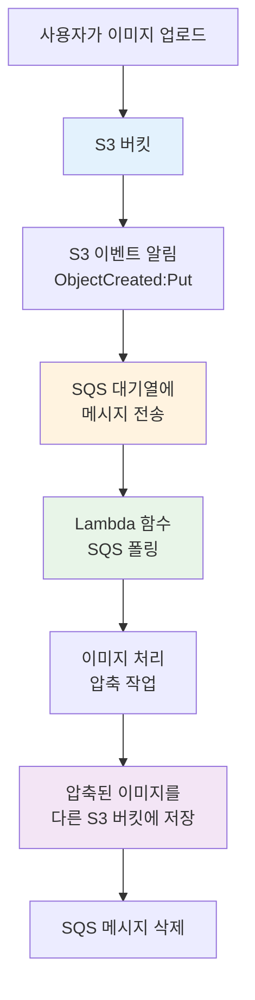

### SQS 메시지 처리 라이프사이클

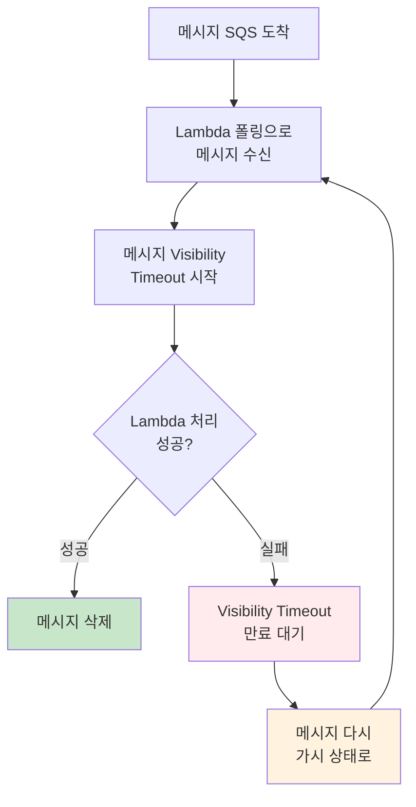

### 전체 이미지 처리 아키텍처

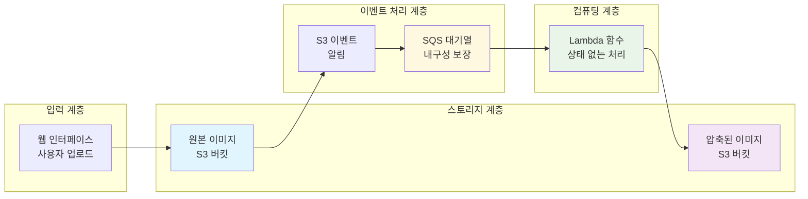

### 아키텍처 장점

1. **내구성 (Durability)**
   - SQS는 메시지를 여러 서버에 복제 저장
   - Lambda 실패 시에도 메시지 보존
   - 자동 재시도 메커니즘

2. **상태 없음 (Stateless)**
   - Lambda는 완전한 서버리스, 상태 비저장
   - SQS는 외부 저장소로 상태 분리
   - 각 요청이 독립적으로 처리

3. **확장성 (Scalability)**
   - SQS는 자동으로 확장
   - Lambda는 동시 실행 수만큼 자동 확장
   - 트래픽 급증에도 유연하게 대응

4. **비용 효율성**
   - 사용한 만큼만 과금 (Pay-as-you-go)
   - 서버 관리 불필요
   - 자동 스케일링으로 리소스 최적화

## 3번 문제

### 정답: D

RDS 이벤트 알림을 구독하고 Amazon Simple Notification Service(Amazon SNS) 주제를 여러 Amazon Simple Queue Service(Amazon SQS) 대기열로 분산하여 보냅니다. AWS Lambda 함수를 사용하여 대상을 업데이트합니다.

### 풀이 근거

**요구사항 분석:**
- 자동차 판매 시 RDS 데이터베이스 업데이트 발생
- 여러 대상 시스템으로 데이터 전송 필요
- 확장 가능하고 신뢰할 수 있는 분산 아키텍처

**정답(D) 근거:**
1. **SNS Fanout 패턴의 활용**
   - 1개의 SNS 토픽에서 여러 SQS 대기열로 메시지 팬아웃
   - 각 대상 시스템은 독립적인 SQS 대기열 보유
   - 병렬 처리와 시스템 간 느슨한 결합 달성

2. **SQS 대기열의 장점**
   - 메시지 지속성과 자동 재시도 메커니즘
   - 각 대상 시스템이 자체 속도로 메시지 처리
   - 대상 시스템 장애 시에도 메시지 보존

3. **Lambda의 역할**
   - 각 SQS 대기열을 이벤트 소스로 사용
   - 비즈니스 로직 처리 및 대상 시스템 업데이트
   - 서버리스로 관리 오버헤드 최소화

**다른 선택지가 틀린 이유:**
- **A**: 단일 SQS 대기열로는 여러 대상 시스템에 독립적 분산 불가
- **B**: FIFO 대기열은 처리량이 제한적이고 여러 대상에 부적합
- **C**: SQS 대기열을 여러 SNS 토픽으로 분산하는 것은 불가능한 구조

**실제 구현 시 고려사항:**
- RDS 이벤트 알림은 데이터베이스 수준 이벤트만 지원
- 테이블 데이터 변경(INSERT/UPDATE/DELETE)은 직접 감지 불가
- 실제로는 애플리케이션 레벨 트리거 또는 DMS CDC 사용 필요

### 참고한 AWS 공식 문서

1. **[Fanout Amazon SNS notifications to Amazon SQS queues](https://docs.aws.amazon.com/sns/latest/dg/sns-sqs-as-subscriber.html)**
   - SNS-SQS fanout 패턴의 구현 방법
   - 메시지 형식과 JSON 구조 설명

2. **[Working with Amazon RDS event notification](https://docs.aws.amazon.com/AmazonRDS/latest/UserGuide/USER_Events.html)**
   - RDS 이벤트 알림이 SNS를 통해 제공됨
   - 지원되는 이벤트 카테고리와 제한사항

3. **[Send Fanout Event Notifications with Amazon SQS and Amazon SNS](https://aws.amazon.com/getting-started/hands-on/send-fanout-event-notifications/)**
   - Fanout 메시징 시나리오 구현 튜토리얼
   - 여러 구독자에게 병렬 비동기 처리 방법

4. **[Amazon SQS, Amazon SNS, or Amazon EventBridge?](https://docs.aws.amazon.com/decision-guides/latest/sns-or-sqs-or-eventbridge/sns-or-sqs-or-eventbridge.html)**
   - 각 서비스의 차이점과 사용 사례
   - 메시징 패턴 선택 가이드

### SNS-SQS Fanout 패턴

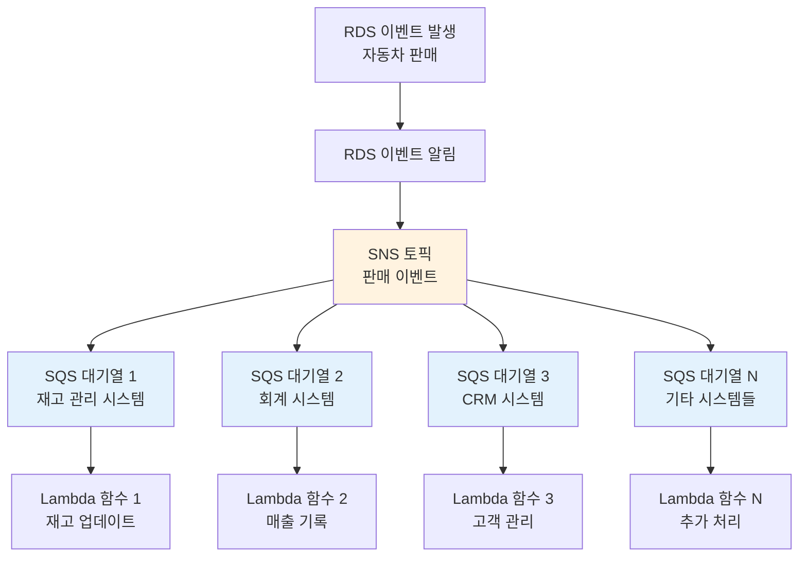

### 전체 이벤트 처리 아키텍처

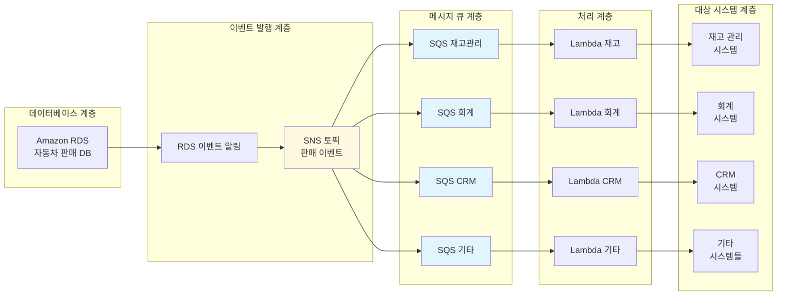

### 메시지 플로우 및 장애 처리

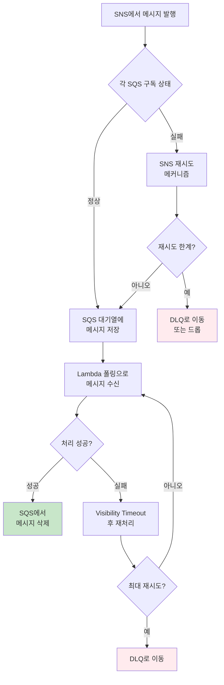

### 아키텍처 장점

1. **확장성 (Scalability)**
   - 새로운 대상 시스템 추가 시 SQS 구독만 추가
   - 기존 시스템에 영향 없이 확장 가능
   - 각 시스템이 독립적으로 스케일링

2. **내결함성 (Fault Tolerance)**
   - 한 시스템의 장애가 다른 시스템에 영향 없음
   - SQS의 메시지 지속성으로 데이터 손실 방지
   - 자동 재시도 및 DLQ 메커니즘

3. **느슨한 결합 (Loose Coupling)**
   - 각 대상 시스템은 SNS 토픽만 구독
   - 시스템 간 직접적인 의존성 제거
   - 독립적인 개발 및 배포 가능

4. **비용 효율성**
   - 사용량 기반 과금 모델
   - 서버리스 아키텍처로 관리 비용 절약
   - 자동 스케일링으로 리소스 최적화

## 4번 문제

### 정답: B

프로덕션 EC2 인스턴스에는 예약 인스턴스를 사용합니다. 개발 및 테스트 EC2 인스턴스에는 온디맨드 인스턴스를 사용합니다.

### 풀이 근거

**요구사항 분석:**
- **프로덕션 환경**: 24시간 연속 실행, 중단 불가능
- **개발/테스트 환경**: 매일 최소 8시간 실행, 사용하지 않을 때 중단 계획
- **CPU 사용률**: 피크 시간 30%, 비피크 시간 10% (전반적으로 낮은 사용률)
- **목표**: 3계층 웹 아키텍처의 비용 절감

**정답(B) 근거:**
1. **프로덕션에 Reserved Instances 사용**
   - 24시간 연속 실행 = 예측 가능하고 일정한 사용 패턴
   - 온디맨드 대비 최대 72% 할인 가능
   - 1년 또는 3년 약정으로 장기 할인 혜택
   - 중단 없는 안정적 운영 보장

2. **개발/테스트에 On-Demand Instances 사용**
   - 유연한 시작/중단 기능으로 자동화에 적합
   - 매일 8시간만 사용 = 약 33% 사용률
   - 사용한 시간에 대해서만 과금
   - Reserved 약정 없이 필요할 때만 비용 발생

**다른 선택지가 틀린 이유:**
- **A**: Spot Instances는 언제든 중단될 수 있어 프로덕션 환경에 부적합. Reserved는 개발/테스트의 간헐적 사용에 비효율적
- **C**: Spot Blocks는 2021년 7월부터 신규 고객 사용 불가
- **D**: On-Demand는 프로덕션 24시간 운영에 비용이 높음. Spot Blocks는 더 이상 사용 불가

**중요한 사실:**
- **Spot Blocks 종료**: AWS는 2021년 7월부터 신규 고객에게 Spot Blocks 제공 중단, 2022년 12월 31일 완전 종료
- **Spot Instances의 한계**: 수요 증가 시 언제든 2분 전 통지 후 중단 가능하여 프로덕션 환경에 부적합

### 참고한 AWS 공식 문서

1. **[What's the Difference Between On-Demand Instances and Reserved Instances?](https://aws.amazon.com/compare/the-difference-between-on-demand-instances-and-reserved-instances/)**
   - Reserved Instance는 최대 72% 할인 제공
   - 50% 사용률에서도 On-Demand 대비 절약 효과

2. **[New – EC2 Spot Blocks for Defined-Duration Workloads](https://aws.amazon.com/blogs/aws/new-ec2-spot-blocks-for-defined-duration-workloads/)**
   - 2021년 7월부터 신규 고객 사용 불가
   - 2022년 12월 31일 완전 지원 종료

3. **[Amazon EC2 Reserved Instances Pricing](https://aws.amazon.com/ec2/pricing/reserved-instances/pricing/)**
   - 1년 및 3년 약정 옵션별 할인율
   - 선불, 부분 선불, 후불 결제 옵션

4. **[When to Use Spot Instances](https://docs.aws.amazon.com/whitepapers/latest/cost-optimization-leveraging-ec2-spot-instances/when-to-use-spot-instances.html)**
   - 중단 허용 가능한 워크로드에만 적합
   - 프로덕션 환경에는 권장하지 않음

### EC2 인스턴스 가격 모델 비교

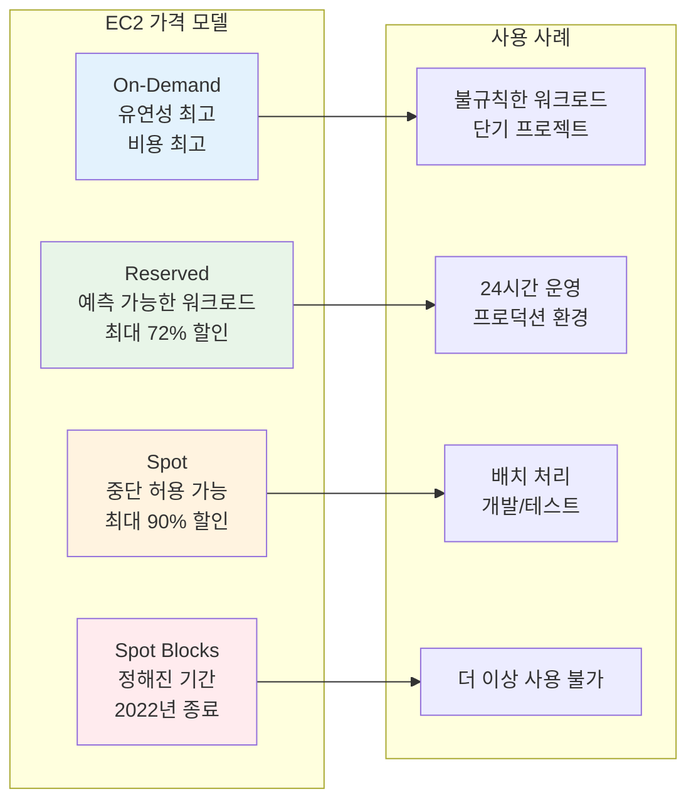

### 환경별 인스턴스 선택 플로우차트

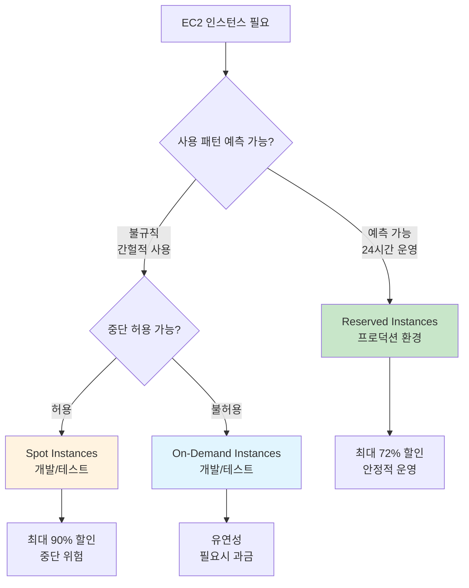

### 3계층 아키텍처 비용 최적화 전략

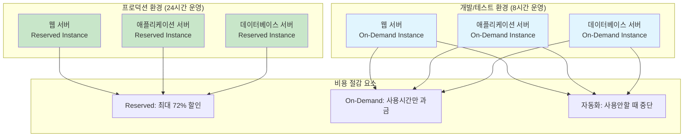

### 비용 계산 예시

**가정: c5.large 인스턴스 (미국 동부 버지니아)**
- On-Demand 시간당 요금: $0.096

**프로덕션 환경 (24시간 × 365일 = 8,760시간/년)**
- On-Demand 연간 비용: $841.00
- Reserved (1년 약정) 연간 비용: $504.00
- **절약액: $337.00 (40% 할인)**

**개발/테스트 환경 (8시간 × 365일 = 2,920시간/년)**
- On-Demand 연간 비용: $280.00
- Reserved (1년 약정) 연간 비용: $504.00 (사용률 무관)
- **On-Demand가 $224.00 더 저렴**

### 최적화 전략 장점

1. **비용 효율성**
   - 프로덕션: Reserved로 최대 할인
   - 개발/테스트: On-Demand로 유연한 비용 관리

2. **운영 안정성**
   - 프로덕션: Reserved로 중단 없는 안정적 운영
   - 개발/테스트: On-Demand로 필요시 즉시 시작

3. **관리 복잡성 최소화**
   - Spot의 중단 처리 로직 불필요
   - 단순한 시작/중단 자동화만 구현

4. **확장성**
   - 프로덕션 확장 시 Reserved 추가 구매
   - 개발/테스트는 필요에 따라 On-Demand 확장