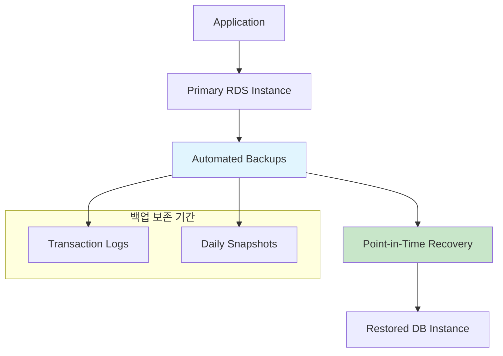
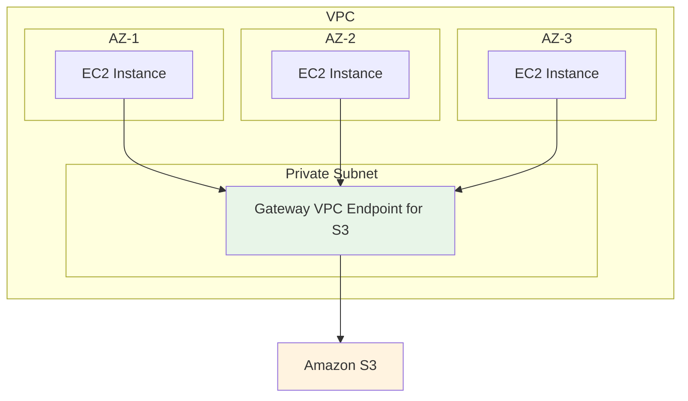
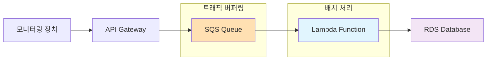
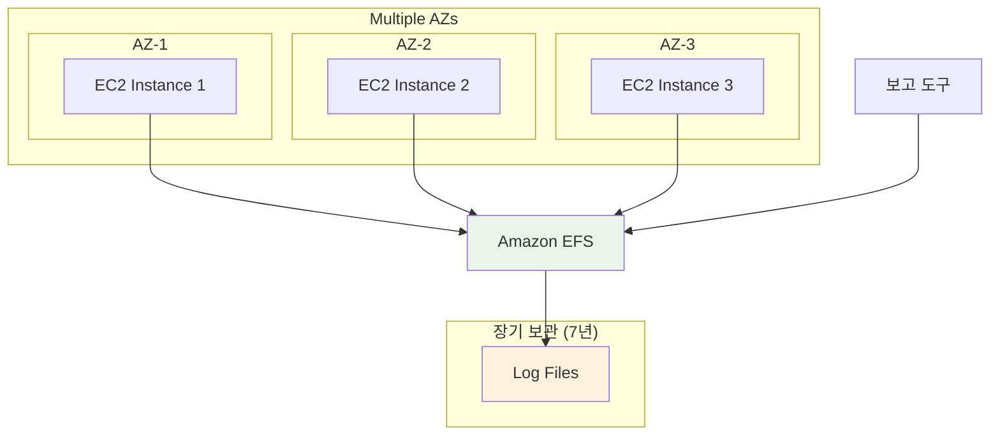
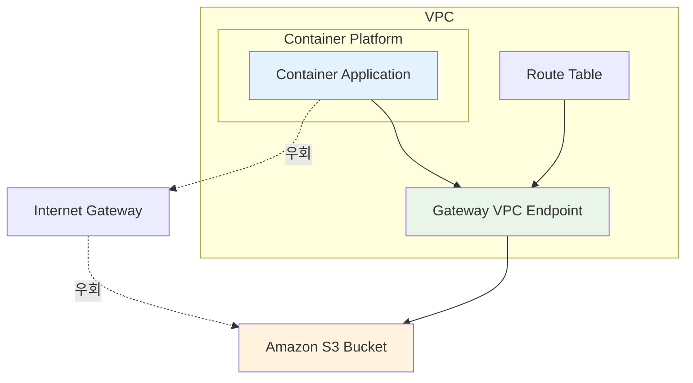

# SAA W3 문제 풀이

## 문제 1번
### 정답: C
자동 백업을 통한 Point-in-Time Recovery

### 풀이 근거
- **A. 읽기 복제본 (read replica)**: 읽기 복제본은 읽기 성능 향상을 위한 것으로, 데이터베이스 복원 기능은 제공하지 않음
- **B. 수동 스냅샷**: 스냅샷은 특정 시점의 백업이므로 "5분 전"과 같은 정확한 시점으로 복원할 수 없음
- **C. 자동 백업**: ✅ **정답** - Point-in-Time Recovery를 통해 보존 기간(최대 35일) 내 어느 시점으로든 복원 가능. 5분 단위까지 정확한 복원 지원
- **D. 다중 AZ 배포 (multi-az)**: 고가용성을 위한 설정으로, 데이터 복원 기능과는 무관

### 아키텍처 다이어그램

### 레퍼런스
- [RDS Point-in-Time Recovery 공식 문서](https://docs.aws.amazon.com/AmazonRDS/latest/UserGuide/AutomatedBackups.PiTR.html)
- [RDS 자동 백업 개요](https://docs.aws.amazon.com/AmazonRDS/latest/UserGuide/USER_WorkingWithAutomatedBackups.html)

---

## 문제 2번
### 정답: C
Amazon S3에 대한 게이트웨이 VPC 엔드포인트 배포

### 풀이 근거
- **A. 각 가용성 영역에서 NAT 게이트웨이 시작**: 비용이 더 증가함. NAT 게이트웨이 자체에도 시간당 요금과 데이터 처리 요금이 부과됨
- **B. NAT 게이트웨이를 NAT 인스턴스로 교체**: 관리 부담이 증가하고, 여전히 인터넷을 통한 데이터 전송 비용 발생
- **C. Amazon S3에 대한 게이트웨이 VPC 엔드포인트 배포**: ✅ **정답** - VPC 내부에서 S3로 직접 연결되어 인터넷 게이트웨이나 NAT 게이트웨이를 거치지 않음. **추가 비용 없음**
- **D. EC2 전용 호스트 프로비저닝**: 데이터 전송 비용과는 무관하며, 오히려 비용이 더 증가함

### 아키텍처 다이어그램

### 레퍼런스
- [S3 Gateway VPC Endpoint 공식 문서](https://docs.aws.amazon.com/vpc/latest/privatelink/vpc-endpoints-s3.html)
- [AWS 아키텍처 데이터 전송 비용 개요](https://aws.amazon.com/blogs/architecture/overview-of-data-transfer-costs-for-common-architectures/)

---

## 문제 3번
### 정답: C
Amazon SQS 대기열과 AWS Lambda 함수를 통한 비동기 처리

### 풀이 근거
- **A. DB 인스턴스 크기 늘리기**: 트래픽 변동이 심한 상황에서는 비효율적이며, 연결 수 문제를 근본적으로 해결하지 못함
- **B. Multi-AZ DB 인스턴스로 수정**: Multi-AZ는 고가용성을 위한 것으로, 쓰기 성능 향상에는 도움이 되지 않음. 모든 인스턴스에 쓰기하는 것도 불가능
- **C. SQS + Lambda 패턴**: ✅ **정답** - API가 SQS에 메시지를 쓰고, Lambda가 배치 처리로 DB에 저장. **데이터 손실 방지**, **연결 수 최소화**, **트래픽 버퍼링** 효과
- **D. SNS + Lambda 패턴**: SNS는 즉시 전달하는 pub/sub 패턴으로, 트래픽 버퍼링 효과가 없어 부적절

### 아키텍처 다이어그램

### 레퍼런스
- [Lambda와 SQS 통합 공식 문서](https://docs.aws.amazon.com/lambda/latest/dg/with-sqs.html)
- [API Gateway SQS Lambda 비동기 처리 패턴](https://docs.aws.amazon.com/prescriptive-guidance/latest/patterns/process-events-asynchronously-with-amazon-api-gateway-amazon-sqs-and-aws-fargate.html)

---

## 문제 4번
### 정답: B
Amazon Elastic File System (Amazon EFS)

### 풀이 근거
- **A. Amazon EBS**: 단일 EC2 인스턴스에만 연결 가능하여 "모든 파일에 동시에 액세스" 요구사항 불충족
- **B. Amazon EFS**: ✅ **정답** - **여러 EC2 인스턴스에서 동시 접근 가능**한 공유 파일 시스템. NFSv4 프로토콜 지원으로 보고 도구의 동시 액세스 가능
- **C. EC2 인스턴스 스토어**: 임시 스토리지로 7년 장기 보관에 부적절하며, 인스턴스 종료 시 데이터 손실
- **D. Amazon S3**: 객체 스토리지로 파일 시스템 접근 방식과 호환되지 않음. 보고 도구가 직접 접근하기 어려움

### 아키텍처 다이어그램

### 레퍼런스
- [Amazon EFS 다중 EC2 인스턴스 마운트](https://docs.aws.amazon.com/efs/latest/ug/mount-multiple-ec2-instances.html)
- [EFS 언제 선택할지 가이드](https://aws.amazon.com/efs/when-to-choose-efs/)

---

## 문제 5번
### 정답: C
Amazon S3에 대한 게이트웨이 VPC 엔드포인트 생성

### 풀이 근거
- **A. S3 Intelligent-Tiering 활성화**: 스토리지 비용 최적화는 되지만 데이터 전송 비용이나 인터넷 트래픽과는 무관
- **B. S3 전송 가속 활성화**: 전송 속도 향상을 위한 기능으로, 비용 절감과는 반대 효과
- **C. 게이트웨이 VPC 엔드포인트**: ✅ **정답** - VPC 내부에서 S3로 직접 연결하여 **인터넷 트래픽 우회**, **데이터 전송 비용 절감**, **추가 비용 없음**
- **D. 인터페이스 VPC 엔드포인트**: S3의 경우 게이트웨이 엔드포인트가 더 비용 효율적. 인터페이스 엔드포인트는 시간당 요금 부과

### 아키텍처 다이어그램

### 레퍼런스
- [S3 Gateway VPC Endpoint 공식 문서](https://docs.aws.amazon.com/vpc/latest/privatelink/vpc-endpoints-s3.html)
- [VPC Endpoint를 통한 비용 최적화](https://aws.amazon.com/blogs/architecture/overview-of-data-transfer-costs-for-common-architectures/)

### 📌 관련 개념
- RDS 백업 및 복원 전략
- VPC 엔드포인트를 통한 비용 최적화
- 비동기 메시징 패턴 (SQS + Lambda)
- AWS 스토리지 서비스 비교
- 컨테이너 환경에서의 네트워크 최적화