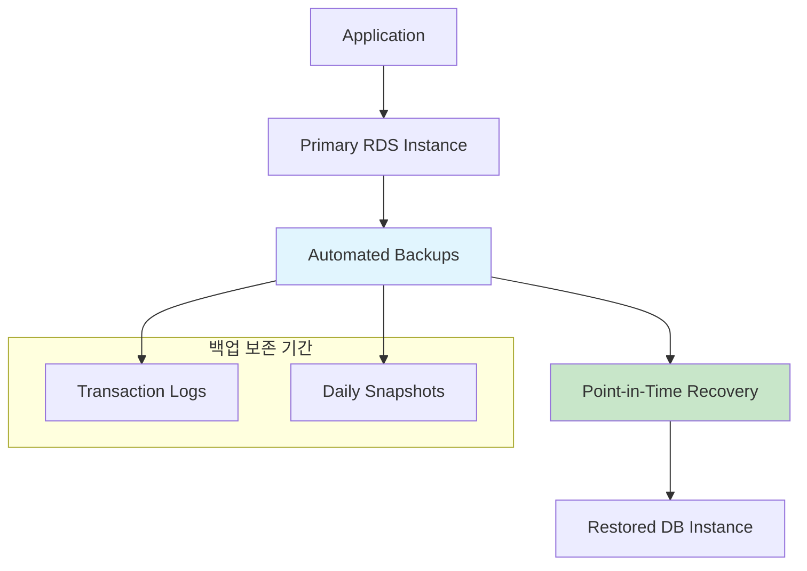
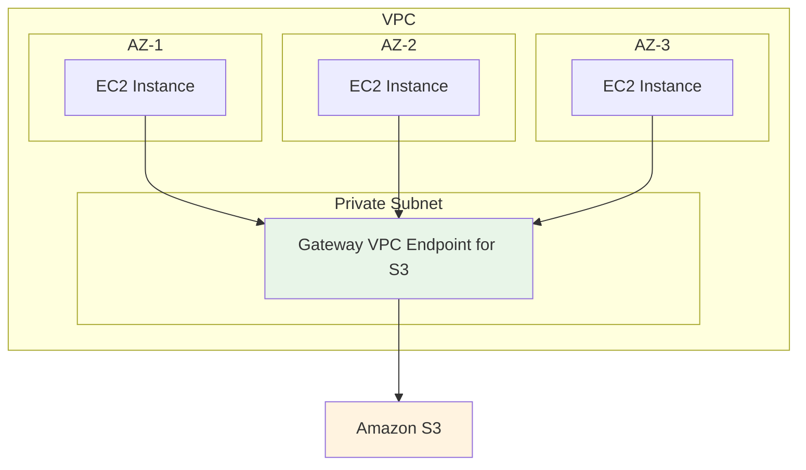
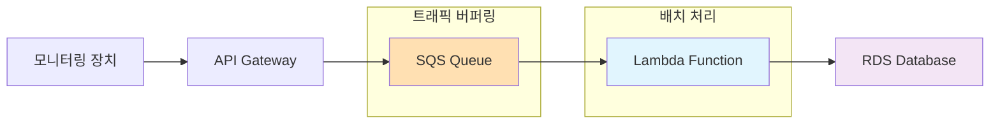
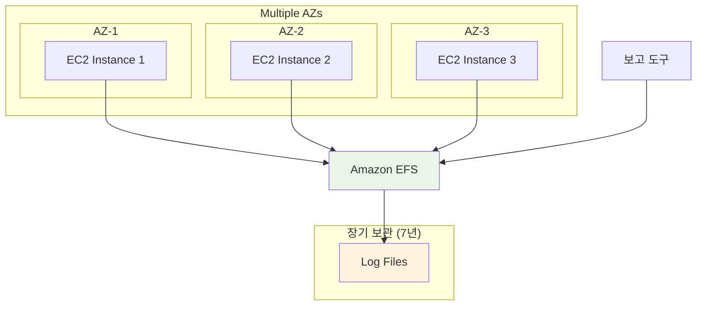
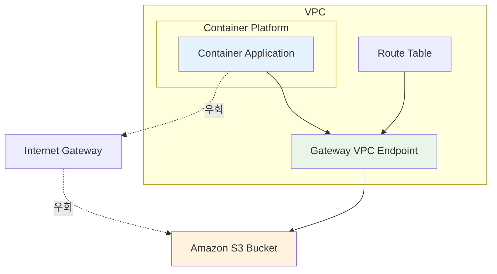

# SAA W3 문제 풀이

## 문제 1번
### 정답: C
자동 백업을 통한 Point-in-Time Recovery

### 풀이 근거
- **A. 읽기 복제본 (read replica)**: 읽기 복제본은 읽기 성능 향상을 위한 것으로, 데이터베이스 복원 기능은 제공하지 않음 → [RDS Read Replicas 공식 문서](https://docs.aws.amazon.com/AmazonRDS/latest/UserGuide/USER_ReadRepl.html)
- **B. 수동 스냅샷**: 스냅샷은 특정 시점의 백업이므로 "5분 전"과 같은 정확한 시점으로 복원할 수 없음 → [RDS DB Snapshot 공식 문서](https://docs.aws.amazon.com/AmazonRDS/latest/UserGuide/USER_ShareSnapshot.html)
- **C. 자동 백업**: ✅ **정답** - Point-in-Time Recovery를 통해 보존 기간(최대 35일) 내 어느 시점으로든 복원 가능. 5분 단위까지 정확한 복원 지원
- **D. 다중 AZ 배포 (multi-az)**: 고가용성을 위한 설정으로, 데이터 복원 기능과는 무관 → [RDS Multi-AZ 배포 공식 문서](https://docs.aws.amazon.com/AmazonRDS/latest/UserGuide/Concepts.MultiAZ.html)

### 아키텍처 다이어그램

### 핵심 서비스 요약

**RDS 자동 백업**
- 주요 기능: 매일 자동 스냅샷 생성, 5분 단위 트랜잭션 로그 저장, Point-in-Time Recovery 지원
- 사용 사례: 실수로 삭제된 데이터 복구, 특정 시점으로 DB 롤백 필요 시
- 특징: 최대 35일 보존, 백업 윈도우 지정 가능, 추가 스토리지 비용 없음
- 제약: 보존 기간 제한, DB 인스턴스 삭제 시 백업도 함께 삭제

**RDS 읽기 복제본**
- 주요 기능: 비동기 데이터 복제, 읽기 트래픽 분산, 다른 리전에도 생성 가능
- 사용 사례: 읽기 집약적 워크로드 분산, 보고서 생성용 별도 DB, 재해 복구 대비
- 특징: 최대 15개까지 생성 가능, 독립적인 DNS 엔드포인트 제공, 승격하여 독립 DB로 전환 가능
- 제약: 쓰기 작업 불가, 복제 지연 발생 가능, 백업/복원 기능 제공 안 함

**RDS Multi-AZ**
- 주요 기능: 동기식 데이터 복제, 자동 페일오버(1-2분), 단일 엔드포인트 유지
- 사용 사례: 고가용성이 필수인 프로덕션 환경, 계획된 유지보수 시 무중단 운영
- 특징: 데이터베이스 엔진 업데이트 시 다운타임 최소화, 백업이 스탠바이에서 수행되어 성능 영향 최소
- 제약: 읽기 성능 향상 효과 없음, 스탠바이 인스턴스 직접 액세스 불가

**RDS 수동 스냅샷**
- 주요 기능: 사용자가 직접 생성하는 특정 시점 백업, 다른 리전으로 복사 가능, 암호화 지원
- 사용 사례: 장기 보관용 백업, 주요 마일스톤 전 백업, 다른 환경으로 DB 복사
- 특징: 영구 보존 가능, 자동 백업과 별도 삭제 관리, 빠른 복원 속도
- 제약: 정확한 시점 복원 불가, 수동 관리 필요, 스토리지 비용 별도 발생

### 레퍼런스
- [RDS Point-in-Time Recovery 공식 문서](https://docs.aws.amazon.com/AmazonRDS/latest/UserGuide/AutomatedBackups.PiTR.html)
- [RDS 자동 백업 개요](https://docs.aws.amazon.com/AmazonRDS/latest/UserGuide/USER_WorkingWithAutomatedBackups.html)

---

## 문제 2번
### 정답: C
Amazon S3에 대한 게이트웨이 VPC 엔드포인트 배포

### 풀이 근거
- **A. 각 가용성 영역에서 NAT 게이트웨이 시작**: 비용이 더 증가함. NAT 게이트웨이 자체에도 시간당 요금과 데이터 처리 요금이 부과됨 → [NAT Gateway 공식 문서](https://docs.aws.amazon.com/vpc/latest/userguide/vpc-nat-gateway.html)
- **B. NAT 게이트웨이를 NAT 인스턴스로 교체**: 관리 부담이 증가하고, 여전히 인터넷을 통한 데이터 전송 비용 발생 → [NAT 인스턴스 vs NAT Gateway 비교](https://docs.aws.amazon.com/vpc/latest/userguide/vpc-nat-comparison.html)
- **C. Amazon S3에 대한 게이트웨이 VPC 엔드포인트 배포**: ✅ **정답** - VPC 내부에서 S3로 직접 연결되어 인터넷 게이트웨이나 NAT 게이트웨이를 거치지 않음. **추가 비용 없음**
- **D. EC2 전용 호스트 프로비저닝**: 데이터 전송 비용과는 무관하며, 오히려 비용이 더 증가함 → [EC2 Dedicated Hosts 공식 문서](https://docs.aws.amazon.com/AWSEC2/latest/UserGuide/dedicated-hosts-overview.html)

### 아키텍처 다이어그램

### 핵심 서비스 요약

**VPC Gateway Endpoint**
- 주요 기능: S3/DynamoDB 전용 비공개 엔드포인트, 라우팅 테이블 기반 트래픽 제어, IAM 정책 지원
- 사용 사례: 프라이빗 서브넷에서 S3 액세스, 데이터 전송 비용 절감, 보안 강화
- 특징: 추가 비용 없음, 인터넷 트래픽 우회, 대역폭 제한 없음
- 제약: S3/DynamoDB에만 사용 가능, 특정 리전에서만 지원, 로컴 전용

**NAT Gateway**
- 주요 기능: 프라이빗 서브넷의 아웃바운드 인터넷 연결, 자동 확장, 고가용성 지원
- 사용 사례: EC2 인스턴스의 소프트웨어 업데이트, 외부 API 호출, 인터넷 접근 필요 시
- 특징: 완전 관리형 서비스, 대역폭 45Gbps까지 지원, IPv4/IPv6 지원
- 제약: 시간당 + 데이터 처리 비용 발생, 인바운드 연결 불가

**NAT Instance**
- 주요 기능: EC2 기반 NAT 솔루션, 사용자 정의 구성 가능, 보안 그룹 및 라우팅 제어
- 사용 사례: 비용 최적화, 대역폭 제어, 커스텀 네트워크 구성
- 특징: EC2 인스턴스 비용만 발생, 인스턴스 크기에 따라 성능 조절, 예약 인스턴스 사용 가능
- 제약: 수동 관리 필요, 단일 장애 지점, 대역폭 제한 있음

**EC2 Dedicated Host**
- 주요 기능: 물리적 전용 서버, 라이선스 조건 컴플라이언스, 인스턴스 배치 제어
- 사용 사례: Windows Server/SQL Server 라이선스 재사용, 귀제 준수, 전용 하드웨어 필요
- 특징: 물리적 서버 단위 과금, Bring Your Own License(BYOL) 지원, 인스턴스 수준 가시성
- 제약: 매우 고비용, 예약 기간 제약, 데이터 전송 비용과 무관

### 레퍼런스
- [S3 Gateway VPC Endpoint 공식 문서](https://docs.aws.amazon.com/vpc/latest/privatelink/vpc-endpoints-s3.html)
- [AWS 아키텍처 데이터 전송 비용 개요](https://aws.amazon.com/blogs/architecture/overview-of-data-transfer-costs-for-common-architectures/)

---

## 문제 3번
### 정답: C
Amazon SQS 대기열과 AWS Lambda 함수를 통한 비동기 처리

### 풀이 근거
- **A. DB 인스턴스 크기 늘리기**: 트래픽 변동이 심한 상황에서는 비효율적이며, 연결 수 문제를 근본적으로 해결하지 못함 → [RDS 인스턴스 스케일링 가이드](https://aws.amazon.com/blogs/database/scaling-your-amazon-rds-instance-vertically-and-horizontally/)
- **B. Multi-AZ DB 인스턴스로 수정**: Multi-AZ는 고가용성을 위한 것으로, 쓰기 성능 향상에는 도움이 되지 않음. 모든 인스턴스에 쓰기하는 것도 불가능 → [RDS Multi-AZ 배포 공식 문서](https://docs.aws.amazon.com/AmazonRDS/latest/UserGuide/Concepts.MultiAZ.html)
- **C. SQS + Lambda 패턴**: ✅ **정답** - API가 SQS에 메시지를 쓰고, Lambda가 배치 처리로 DB에 저장. **데이터 손실 방지**, **연결 수 최소화**, **트래픽 버퍼링** 효과
- **D. SNS + Lambda 패턴**: SNS는 즉시 전달하는 pub/sub 패턴으로, 트래픽 버퍼링 효과가 없어 부적절 → [SNS Lambda 트리거 공식 문서](https://docs.aws.amazon.com/lambda/latest/dg/example_serverless_SNS_Lambda_section.html)

### 아키텍처 다이어그램

### 핵심 서비스 요약

**Amazon SQS**
- 주요 기능: 메시지 큐잉 서비스, 최대 14일 보관, 데드 레터 큐(DLQ) 지원, 베치 처리 가능
- 사용 사례: 비동기 메시지 처리, 트래픽 버퍼링, 마이크로서비스 간 통신, 작업 대기열
- 특징: 무제한 확장성, 메시지 순서 보장 옵션(FIFO), 가시성 타임아웃 설정 가능
- 제약: 즉시 전달 보장 없음, 메시지 순서 보장 옵션(성능 타협), 중복 메시지 가능

**AWS Lambda**
- 주요 기능: 서버리스 컴퓨팅, 이벤트 기반 자동 실행, 자동 스케일링, 다양한 프로그래밍 언어 지원
- 사용 사례: 마이크로서비스 아키텍처, 이벤트 처리, API 백엔드, 데이터 변환
- 특징: 사용한 만큼만 과금, 빠른 콜드 스타트, 다양한 AWS 서비스와 통합
- 제약: 15분 최대 실행 시간, 메모리 10GB 제한, 콜드 스타트 지연 가능

**Amazon SNS**
- 주요 기능: Pub/Sub 메시징, 다중 반송 대상 지원, 메시지 필터링, 모바일 푸시 알림
- 사용 사례: 실시간 알림, 애플리케이션 간 디커플링, 메시지 팔아웃, 시스템 이벤트 전파
- 특징: 즉시 전달, 대량 처리 가능, 다양한 전송 프로토콜 지원(HTTP, 이메일, SMS)
- 제약: 버퍼링 기능 없음, 메시지 순서 보장 없음, 전송 실패 시 재시도 제한

**API Gateway**
- 주요 기능: RESTful/GraphQL API 관리, 요청 라우팅, 인증/인가, 레이트 리미팅
- 사용 사례: 서버리스 API 게이트웨이, 마이크로서비스 API 통합, 모바일 앱 백엔드
- 특징: 완전 관리형, 다양한 인증 방식 지원, API 버저닝 및 스테이징
- 제약: 콜드 스타트 지연, 메리터링 및 로깅 비용, 커스텀 도메인 설정 필요

### 레퍼런스
- [Lambda와 SQS 통합 공식 문서](https://docs.aws.amazon.com/lambda/latest/dg/with-sqs.html)
- [API Gateway SQS Lambda 비동기 처리 패턴](https://docs.aws.amazon.com/prescriptive-guidance/latest/patterns/process-events-asynchronously-with-amazon-api-gateway-amazon-sqs-and-aws-fargate.html)

---

## 문제 4번
### 정답: B
Amazon Elastic File System (Amazon EFS)

### 풀이 근거
- **A. Amazon EBS**: 단일 EC2 인스턴스에만 연결 가능하여 "모든 파일에 동시에 액세스" 요구사항 불충족 → [EBS 볼륨 연결 공식 문서](https://docs.aws.amazon.com/ebs/latest/userguide/ebs-attaching-volume.html)
- **B. Amazon EFS**: ✅ **정답** - **여러 EC2 인스턴스에서 동시 접근 가능**한 공유 파일 시스템. NFSv4 프로토콜 지원으로 보고 도구의 동시 액세스 가능
- **C. EC2 인스턴스 스토어**: 임시 스토리지로 7년 장기 보관에 부적절하며, 인스턴스 종료 시 데이터 손실 → [EC2 Instance Store 공식 문서](https://docs.aws.amazon.com/AWSEC2/latest/UserGuide/InstanceStorage.html)
- **D. Amazon S3**: 객체 스토리지로 파일 시스템 접근 방식과 호환되지 않음. 보고 도구가 직접 접근하기 어려움 → [S3 Mountpoint 공식 문서](https://docs.aws.amazon.com/AmazonS3/latest/userguide/mountpoint.html)

### 아키텍처 다이어그램

### 핵심 서비스 요약

**Amazon EFS**
- 주요 기능: 다중 EC2 공유 파일 시스템, NFSv4 프로토콜 지원, 자동 확장/축소, 다중 AZ 지원
- 사용 사례: 콘텐츠 리포지토리, 공유 웹 콘텐츠, 빅데이터 분석, 컴퓨트 클러스터
- 특징: 백업 자동화, 암호화 지원, 성능 모드 선택 가능(General Purpose/Max I/O)
- 제약: POSIX 호환 파일시스템만 지원, Windows EC2에서 직접 마운트 불가

**Amazon EBS**
- 주요 기능: 단일 EC2 전용 블록 스토리지, 스냅샷 지원, 암호화, Multi-Attach 옵션(일부 타입)
- 사용 사례: 데이터베이스 스토리지, 파일 시스템, 부팅 볼륨, 고성능 애플리케이션
- 특징: 다양한 볼륨 타입(gp3, io2, st1 등), 또맰 인스턴스로 마이그레이션 가능
- 제약: 기본적으로 단일 EC2에만 연결, 다중 연결 시 특별 설정 필요

**EC2 Instance Store**
- 주요 기능: 임시 로컬 SSD/NVMe 스토리지, 고성능 I/O, 물리적으로 인스턴스에 연결
- 사용 사례: 캐시 스토리지, 임시 데이터 처리, 고성능 살 스토리지, 리플리케이션 및 분산 시스템
- 특징: 인스턴스 비용에 포함, 매우 낮은 레이턴시, 최대 7.5TB까지 제공
- 제약: 인스턴스 중지/종료 시 데이터 완전 손실, 장기 보관 부적절

**Amazon S3**
- 주요 기능: 객체 스토리지, REST API 접근, 무제한 확장성, 전 세계 공개 액세스 가능
- 사용 사례: 웹 애플리케이션 에셋, 데이터 백업 및 아카이브, 빅데이터 레이크, 정적 웹사이트 호스팅
- 특징: 다양한 스토리지 클래스, Mountpoint로 파일시스템 에뮬레이션, CDN 통합
- 제약: 파일시스템 인터페이스 대신 REST API, 직접 마운트 시 대역폭 제한

### 레퍼런스
- [Amazon EFS 다중 EC2 인스턴스 마운트](https://docs.aws.amazon.com/efs/latest/ug/mount-multiple-ec2-instances.html)
- [EFS 언제 선택할지 가이드](https://aws.amazon.com/efs/when-to-choose-efs/)

---

## 문제 5번
### 정답: C
Amazon S3에 대한 게이트웨이 VPC 엔드포인트 생성

### 풀이 근거
- **A. S3 Intelligent-Tiering 활성화**: 스토리지 비용 최적화는 되지만 데이터 전송 비용이나 인터넷 트래픽과는 무관 → [S3 Intelligent-Tiering 공식 문서](https://docs.aws.amazon.com/AmazonS3/latest/userguide/intelligent-tiering-overview.html)
- **B. S3 전송 가속 활성화**: 전송 속도 향상을 위한 기능으로, 비용 절감과는 반대 효과 → [S3 Transfer Acceleration 공식 문서](https://docs.aws.amazon.com/AmazonS3/latest/userguide/transfer-acceleration.html)
- **C. 게이트웨이 VPC 엔드포인트**: ✅ **정답** - VPC 내부에서 S3로 직접 연결하여 **인터넷 트래픽 우회**, **데이터 전송 비용 절감**, **추가 비용 없음**
- **D. 인터페이스 VPC 엔드포인트**: S3의 경우 게이트웨이 엔드포인트가 더 비용 효율적. 인터페이스 엔드포인트는 시간당 요금 부과 → [Interface VPC Endpoints 공식 문서](https://docs.aws.amazon.com/vpc/latest/privatelink/create-interface-endpoint.html)

### 아키텍처 다이어그램

### 핵심 서비스 요약

**S3 Intelligent-Tiering**
- 주요 기능: 액세스 패턴 기반 자동 스토리지 클래스 전환, 모니터링 및 자동화 비용 추가, 다양한 액세스 티어 지원
- 사용 사례: 액세스 패턴이 불확실한 데이터, 스토리지 비용 최적화, 장기 보관 데이터
- 특징: 성능 영향 없음, 운영 오버헤드 없음, 최대 68% 비용 절감 가능
- 제약: 데이터 전송이나 네트워크 비용에는 무관, 최소 객체 크기 128KB

**S3 Transfer Acceleration**
- 주요 기능: CloudFront 엣지 로케이션 활용 전송 가속, 단일 URL로 전 세계 가속 업로드, 가속도 비교 도구 제공
- 사용 사례: 대용량 파일 업로드, 전 세계 사용자 대상 애플리케이션, 원거리 데이터 전송
- 특징: 50-500% 전송 속도 향상, 기존 애플리케이션 코드 변경 불필요
- 제약: 추가 데이터 전송 비용 발생, 비용 절감과 반대 효과

**VPC Gateway Endpoint (S3용)**
- 주요 기능: S3 전용 비공개 엔드포인트, 라우팅 테이블 기반 트래픽 제어, IAM 정책 지원
- 사용 사례: 프라이빗 서브넷에서 S3 액세스, 데이터 전송 비용 절감, 보안 강화
- 특징: 추가 비용 없음, 인터넷 트래픽 우회, 대역폭 제한 없음
- 제약: S3에만 사용 가능, 로컴 전용, 같은 리전 내에서만 사용

**VPC Interface Endpoint**
- 주요 기능: AWS PrivateLink 기반 비공개 엔드포인트, 대부분 AWS 서비스 지원, ENI 기반 연결
- 사용 사례: 다양한 AWS 서비스에 비공개 접근, 온프레미스-AWS 연결, 보안 준수 요구사항
- 특징: 다중 AZ 지원, DNS 해상 제공, 다양한 서비스 지원(Lambda, ECS, SNS 등)
- 제약: 시간당 과금 + 데이터 처리 비용, S3의 경우 Gateway Endpoint가 더 경제적

### 레퍼런스
- [S3 Gateway VPC Endpoint 공식 문서](https://docs.aws.amazon.com/vpc/latest/privatelink/vpc-endpoints-s3.html)
- [VPC Endpoint를 통한 비용 최적화](https://aws.amazon.com/blogs/architecture/overview-of-data-transfer-costs-for-common-architectures/)

### 📌 관련 개념
- RDS 백업 및 복원 전략
- VPC 엔드포인트를 통한 비용 최적화
- 비동기 메시징 패턴 (SQS + Lambda)
- AWS 스토리지 서비스 비교
- 컨테이너 환경에서의 네트워크 최적화