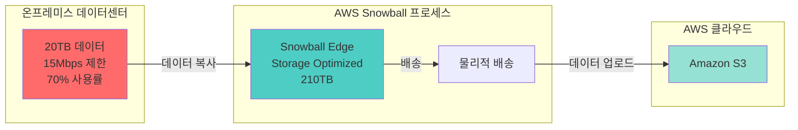
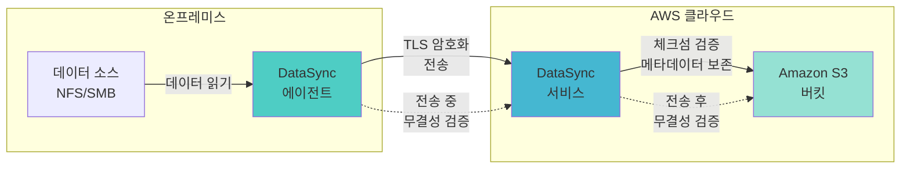
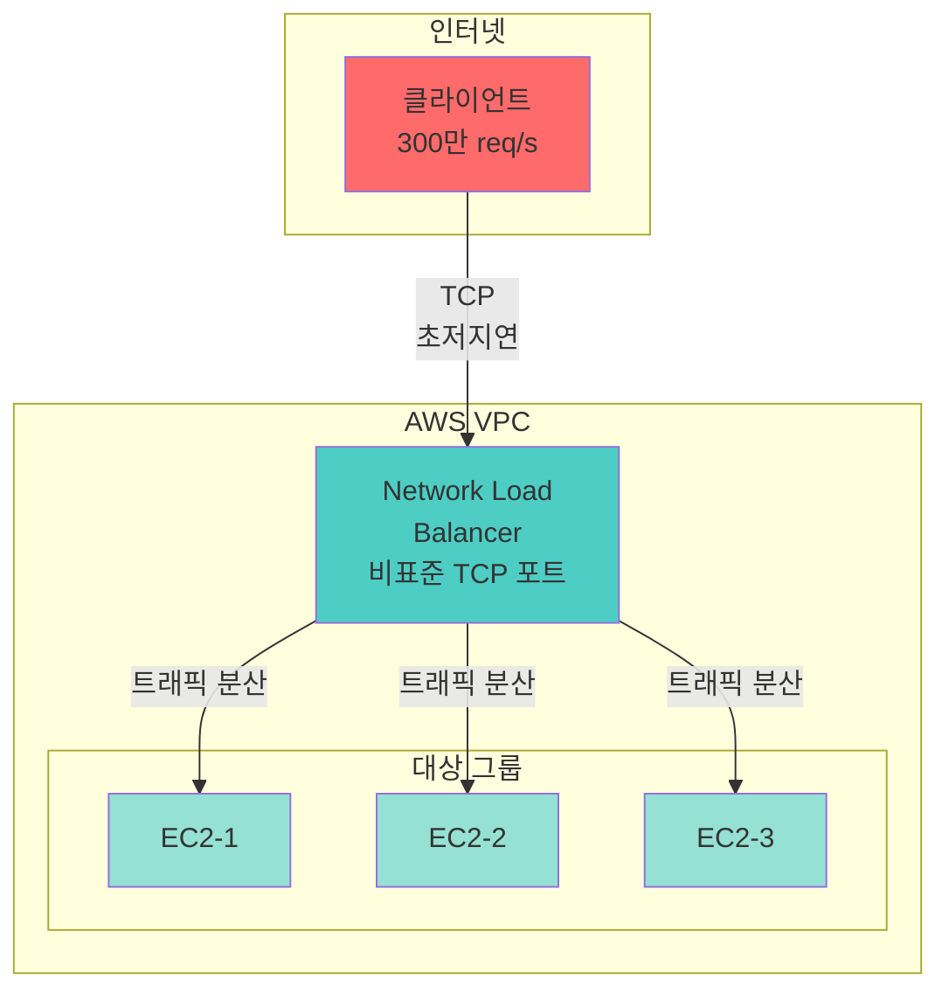
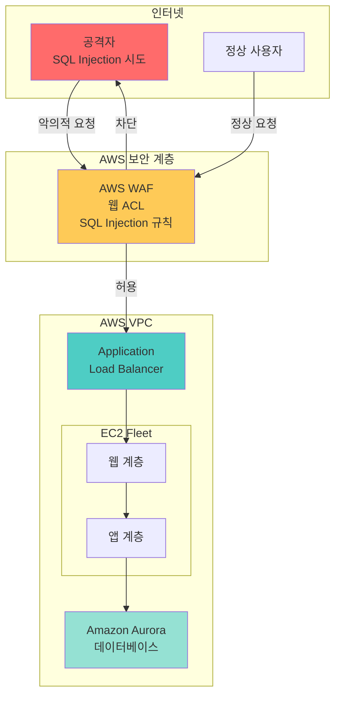
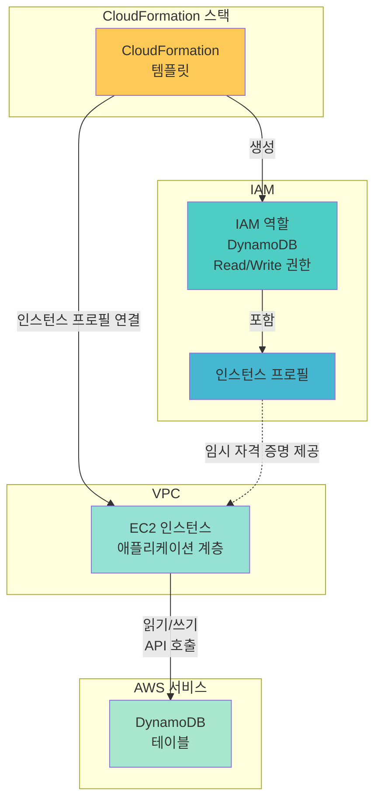

# AWS SAA 문제 풀이 - Week 6

## 문제 1번

### 문제
회사는 30일 이내에 데이터 센터에서 AWS 클라우드로 20TB의 데이터를 마이그레이션해야 합니다. 회사의 네트워크 대역폭은 15Mbps로 제한되며 사용률은 70%를 초과할 수 없습니다.

솔루션 아키텍트는 이러한 요구 사항을 충족하기 위해 무엇을 해야 합니까?

**A.** AWS Snowball을 사용하세요.   
**B.** AWS DataSync를 사용합니다.   
**C.** 안전한 VPN 연결을 사용하세요.  
**D.** Amazon S3 전송 가속을 사용합니다

### 정답: A
AWS Snowball을 사용하여 제한된 대역폭에서 20TB 데이터를 30일 내에 마이그레이션

### 풀이 근거

**대역폭 계산:**
- 15Mbps × 70% = 10.5Mbps 사용 가능
- 10.5Mbps = 1.3125 MB/s
- 30일 = 2,592,000초
- 이론적 전송량 = 1.3125 MB/s × 2,592,000초 ≈ 3,340GB ≈ 3.3TB
- **20TB 전송 필요 → 네트워크로는 불가능**

- **A. AWS Snowball 사용**: ✅ **정답** - Snowball Edge Storage Optimized 210TB 디바이스를 사용하면 물리적 배송을 통해 대용량 데이터를 빠르게 전송 가능. 제한된 대역폭 문제를 우회하여 30일 내 전송 가능 → [AWS Snowball 공식 문서](https://aws.amazon.com/snowball/)

- **B. AWS DataSync 사용**: 네트워크 기반 온라인 전송 서비스로, 15Mbps × 70% = 10.5Mbps로는 20TB를 30일 내 전송 불가능. DataSync는 충분한 대역폭이 있을 때 효과적 → [AWS DataSync 공식 문서](https://docs.aws.amazon.com/datasync/latest/userguide/how-datasync-transfer-works.html)

- **C. 안전한 VPN 연결 사용**: VPN도 동일한 네트워크 대역폭(15Mbps) 제약을 받음. 암호화 오버헤드로 인해 실제 처리량은 더 낮아짐 → [AWS Site-to-Site VPN 공식 문서](https://aws.amazon.com/vpn/site-to-site-vpn/)

- **D. Amazon S3 Transfer Acceleration 사용**: 전송 속도를 개선하지만 근본적인 대역폭 제약(15Mbps)은 해결 불가. 장거리 전송을 최적화하지만 대역폭 자체를 증가시키지는 않음 → [S3 Transfer Acceleration 공식 문서](https://docs.aws.amazon.com/whitepapers/latest/s3-optimizing-performance-best-practices/using-amazon-s3-transfer-acceleration-to-accelerate-geographically-disparate-data-transfers.html)

### 아키텍처 다이어그램

### 핵심 서비스 요약

**AWS Snowball Edge Storage Optimized**
- 주요 기능: 210TB 스토리지 용량, 오프라인 물리적 데이터 전송, 암호화된 데이터 보호
- 사용 사례: 대역폭 제약 환경에서 대용량 데이터 마이그레이션, 페타바이트급 데이터 이동
- 특징/장점: 네트워크 대역폭 제약 우회, 빠른 대량 전송, AWS OpsHub로 관리 용이
- 제약사항: 물리적 배송 시간 필요, 디바이스 수령 및 반송 프로세스 관리 필요

**AWS DataSync**
- 주요 기능: 자동 데이터 무결성 검증, 네트워크 최적화, 증분 전송 지원
- 사용 사례: 충분한 대역폭이 있는 온프레미스-AWS 간 데이터 동기화, 지속적인 데이터 복제
- 특징/장점: 체크섬 기반 무결성 검증, 메타데이터 보존, 스케줄링 지원
- 제약사항: 네트워크 대역폭에 의존, 대역폭 부족 시 전송 시간 증가

**S3 Transfer Acceleration**
- 주요 기능: CloudFront 엣지 로케이션 활용, 최적화된 네트워크 경로, 장거리 전송 가속
- 사용 사례: 전 세계 분산된 사용자의 S3 업로드, 대륙 간 대용량 파일 전송
- 특징/장점: 지리적 거리로 인한 지연 시간 감소, 기존 S3 버킷에 쉽게 적용
- 제약사항: 근본적인 대역폭 제한 해결 불가, 가속 효과 없으면 과금 안 됨

**AWS Site-to-Site VPN**
- 주요 기능: IPsec 암호화 터널, 온프레미스-VPC 안전한 연결, 최대 1.25 Gbps 처리량
- 사용 사례: 온프레미스와 AWS 간 안전한 네트워크 연결, 하이브리드 클라우드 아키텍처
- 특징/장점: 빠른 설정, 고가용성(2개 터널), 완전 관리형
- 제약사항: 인터넷 대역폭 제약, 암호화 오버헤드, ECMP 없이는 1.25Gbps 제한

### 레퍼런스
- [AWS Snowball 공식 문서](https://aws.amazon.com/snowball/)
- [AWS Snowball Edge 대용량 데이터 마이그레이션 가이드](https://docs.aws.amazon.com/snowball/latest/developer-guide/create-data-migration-plan.html)
- [AWS DataSync 작동 방식](https://docs.aws.amazon.com/datasync/latest/userguide/how-datasync-transfer-works.html)
- [S3 Transfer Acceleration](https://docs.aws.amazon.com/whitepapers/latest/s3-optimizing-performance-best-practices/using-amazon-s3-transfer-acceleration-to-accelerate-geographically-disparate-data-transfers.html)
- [AWS Site-to-Site VPN](https://aws.amazon.com/vpn/site-to-site-vpn/)

---

## 문제 2번

### 문제
회사가 사내에 데이터를 저장합니다. 데이터 양이 회사의 가용 용량을 초과하여 증가하고 있습니다. 회사는 사내 위치에서 Amazon S3 버킷으로 데이터를 마이그레이션하려고 합니다. 회사는 전송 후 데이터 무결성을 자동으로 검증하는 솔루션이 필요합니다.

어떤 솔루션이 이러한 요구 사항을 충족할까요?

**A.** AWS Snowball Edge 장치를 주문합니다. Snowball Edge 장치를 구성하여 S3 버킷으로 온라인 데이터 전송을 수행합니다.  
**B.** 온프레미스에 AWS DataSync 에이전트를 배포합니다. DataSync 에이전트를 구성하여 S3 버킷으로 온라인 데이터 전송을 수행합니다.  
**C.** 온프레미스에서 Amazon S3 파일 게이트웨이 생성 S3 파일 게이트웨이를 구성하여 S3 버킷으로 온라인 데이터 전송을 수행합니다.  
**D.** 온프레미스에서 Amazon S3 Transfer Acceleration에서 가속기를 구성합니다. 가속기를 구성하여 S3 버킷으로 온라인 데이터 전송을 수행합니다.

### 정답: B
온프레미스에 AWS DataSync 에이전트를 배포하여 자동 무결성 검증과 함께 S3로 데이터 전송

### 풀이 근거

- **A. AWS Snowball Edge 장치 사용**: Snowball Edge는 오프라인 물리적 전송용으로, "온라인 데이터 전송"에는 적합하지 않음. 또한 Snowball Edge 자체는 S3로 직접 온라인 전송하는 디바이스가 아님 → [AWS Snowball Edge 공식 문서](https://aws.amazon.com/snowball/)

- **B. AWS DataSync 에이전트 배포**: ✅ **정답** - DataSync는 온프레미스에 에이전트를 설치하여 S3로 온라인 데이터 전송을 수행하며, 전송 중과 전송 후 자동으로 체크섬 기반 무결성 검증을 제공. 메타데이터도 보존 → [AWS DataSync 데이터 무결성 검증](https://docs.aws.amazon.com/datasync/latest/userguide/configure-data-verification-options.html)

- **C. S3 File Gateway 생성**: S3 File Gateway는 온프레미스 애플리케이션이 NFS/SMB 프로토콜로 S3에 접근하기 위한 하이브리드 스토리지 솔루션. 데이터 마이그레이션보다는 지속적인 파일 액세스에 적합하며, 자동 무결성 검증 기능은 DataSync만큼 강력하지 않음 → [S3 File Gateway 공식 문서](https://docs.aws.amazon.com/filegateway/latest/files3/what-is-file-s3.html)

- **D. S3 Transfer Acceleration 가속기 구성**: Transfer Acceleration은 S3 버킷 속성으로, "온프레미스에서 가속기를 구성"하는 것이 아님. 또한 자동 무결성 검증을 제공하지 않음 → [S3 Transfer Acceleration 공식 문서](https://aws.amazon.com/s3/transfer-acceleration/)

### 아키텍처 다이어그램

### 핵심 서비스 요약

**AWS DataSync**
- 주요 기능: 자동 체크섬 기반 무결성 검증, 네트워크 최적화 전송, 메타데이터 및 권한 보존, 증분 전송
- 사용 사례: 온프레미스에서 S3/EFS/FSx로 대용량 데이터 마이그레이션, 지속적인 데이터 동기화
- 특징/장점: 전송 중과 전송 후 자동 검증, 최대 10배 빠른 전송 속도, 스케줄링 지원, 대역폭 제한 설정 가능
- 제약사항: 온프레미스에 에이전트 설치 필요, 네트워크 대역폭에 의존

**AWS Snowball Edge**
- 주요 기능: 210TB 오프라인 스토리지, 엣지 컴퓨팅 지원, 물리적 데이터 전송
- 사용 사례: 대역폭 제한 환경에서 대용량 초기 마이그레이션, 원격지 데이터 수집
- 특징/장점: 네트워크 제약 우회, 페타바이트급 데이터 전송, 암호화 보안
- 제약사항: 물리적 배송 시간 소요, 온라인 실시간 전송 불가, 디바이스 관리 필요

**Amazon S3 File Gateway**
- 주요 기능: NFS/SMB 프로토콜 지원, 로컬 캐싱, S3 객체로 파일 저장
- 사용 사례: 온프레미스 애플리케이션의 S3 파일 액세스, 하이브리드 클라우드 스토리지, 백업 아카이빙
- 특징/장점: 기존 파일 기반 애플리케이션과 통합 용이, 로컬 캐시로 빠른 액세스, S3 스토리지 클래스 활용
- 제약사항: 쓰기 성능 제한적, 다중 쓰기에 적합하지 않음, 주로 읽기 집약적 워크로드용

**Amazon S3 Transfer Acceleration**
- 주요 기능: CloudFront 엣지 로케이션 활용, 최적화된 네트워크 경로, 거리별 전송 가속
- 사용 사례: 전 세계 분산 클라이언트의 대용량 파일 업로드, 장거리 데이터 전송
- 특징/장점: 지리적 지연 시간 최소화, 기존 S3 API 호환, 가속 효과 있을 때만 과금
- 제약사항: 무결성 검증 기능 없음, 단순 전송 가속만 제공, 대역폭 제한은 해결 불가

### 레퍼런스
- [AWS DataSync 데이터 무결성 검증 구성](https://docs.aws.amazon.com/datasync/latest/userguide/configure-data-verification-options.html)
- [AWS DataSync 작동 방식](https://docs.aws.amazon.com/datasync/latest/userguide/how-datasync-transfer-works.html)
- [AWS Snowball Edge](https://aws.amazon.com/snowball/)
- [Amazon S3 File Gateway](https://docs.aws.amazon.com/filegateway/latest/files3/what-is-file-s3.html)
- [S3 Transfer Acceleration](https://aws.amazon.com/s3/transfer-acceleration/)

---

## 문제 3번

### 문제
한 회사가 TCP 기반 애플리케이션을 회사의 VPC로 마이그레이션할 계획입니다. 이 애플리케이션은 회사 데이터 센터의 하드웨어 어플라이언스를 통해 비표준 TCP 포트에서 공개적으로 액세스할 수 있습니다.

이 퍼블릭 엔드포인트는 낮은 지연 시간으로 초당 최대 300만 개의 요청을 처리할 수 있습니다. 이 회사는 AWS의 새로운 퍼블릭 엔드포인트에 대해 동일한 수준의 성능이 필요합니다.

솔루션 아키텍트는 이 요구 사항을 충족하기 위해 무엇을 권장해야 합니까?

**A.** 네트워크 로드 밸런서(NLB)를 배포합니다. 애플리케이션에 필요한 TCP 포트를 통해 공개적으로 액세스할 수 있도록 NLB를 구성합니다.    
**B.** 애플리케이션 로드 밸런서(ALB)를 배포합니다. 애플리케이션에 필요한 TCP 포트를 통해 ALB를 공개적으로 액세스할 수 있도록 구성합니다.    
**C.** 애플리케이션에 필요한 TCP 포트에서 수신 대기하는 Amazon CloudFront 배포를 배포합니다. Application Load Balancer를 원본으로 사용합니다.  
**D.** 애플리케이션에 필요한 TCP 포트로 구성된 Amazon API Gateway API를 배포합니다. 요청을 처리하기 위해 프로비저닝된 동시성을 사용하여 AWS Lambda 함수를 구성합니다  

### 정답: A
Network Load Balancer(NLB)를 배포하여 비표준 TCP 포트에서 초당 300만 요청 처리

### 풀이 근거

- **A. Network Load Balancer(NLB) 배포**: ✅ **정답** - NLB는 Layer 4(전송 계층)에서 작동하며 초당 수백만 요청을 처리할 수 있는 초고성능 로드 밸런서. TCP/UDP/TLS 트래픽 지원, 초저지연, 비표준 포트 지원, 고정 IP 제공 → [Network Load Balancer 공식 문서](https://aws.amazon.com/elasticloadbalancing/network-load-balancer/)

- **B. Application Load Balancer(ALB) 배포**: ALB는 Layer 7(애플리케이션 계층)에서 HTTP/HTTPS 트래픽을 처리하는 로드 밸런서. TCP 기반 비표준 포트 애플리케이션에는 적합하지 않으며, NLB보다 처리량과 지연 시간에서 불리 → [Application Load Balancer 공식 문서](https://aws.amazon.com/elasticloadbalancing/application-load-balancer/)

- **C. CloudFront 배포 with ALB 원본**: CloudFront는 주로 HTTP/HTTPS 콘텐츠 배포를 위한 CDN 서비스. 비표준 TCP 포트를 직접 지원하지 않으며, Layer 7 서비스로 TCP 기반 애플리케이션에 부적합 → [Amazon CloudFront 프로토콜 최적화](https://docs.aws.amazon.com/whitepapers/latest/amazon-cloudfront-media/request-handling-and-protocol-optimizations.html)

- **D. API Gateway with Lambda**: API Gateway는 REST API, WebSocket API를 위한 서비스로, 비표준 TCP 포트의 범용 TCP 애플리케이션에는 적합하지 않음. 초당 300만 요청 처리에도 Lambda 동시성 제약이 문제 → [API Gateway WebSocket 개요](https://docs.aws.amazon.com/apigateway/latest/developerguide/apigateway-websocket-api-overview.html)

### 아키텍처 다이어그램

### 핵심 서비스 요약

**Network Load Balancer (NLB)**
- 주요 기능: Layer 4 로드 밸런싱, 초당 수백만 요청 처리, 초저지연(<100ms), TCP/UDP/TLS 지원, 고정 IP 제공
- 사용 사례: 고성능 TCP/UDP 애플리케이션, 실시간 스트리밍, IoT, 게임 서버, 비표준 포트 애플리케이션
- 특징/장점: 극한 성능, 소스 IP 보존, 정적/탄력적 IP 지원, Zone 격리, TLS 오프로딩
- 제약사항: Layer 7 기능 없음(콘텐츠 기반 라우팅 불가), WebSocket 직접 지원 제한적

**Application Load Balancer (ALB)**
- 주요 기능: Layer 7 로드 밸런싱, HTTP/HTTPS 트래픽, 콘텐츠 기반 라우팅, 호스트/경로 기반 라우팅
- 사용 사례: 마이크로서비스, 컨테이너 기반 애플리케이션, 웹 애플리케이션, REST API
- 특징/장점: 고급 라우팅 규칙, AWS WAF 통합, Lambda 대상 지원, 인증 오프로딩
- 제약사항: HTTP/HTTPS만 지원, TCP 비표준 포트 미지원, NLB보다 높은 지연 시간

**Amazon CloudFront**
- 주요 기능: 글로벌 CDN, 엣지 로케이션 캐싱, HTTP/HTTPS 콘텐츠 배포, DDoS 보호
- 사용 사례: 정적/동적 웹 콘텐츠 배포, 비디오 스트리밍, API 가속, 글로벌 애플리케이션
- 특징/장점: 전 세계 낮은 지연 시간, Shield Standard 통합, 비용 효율적 대역폭
- 제약사항: 주로 HTTP/HTTPS 프로토콜, 비표준 TCP 포트 미지원, WebSocket은 HTTP/1.1만 지원

**Amazon API Gateway**
- 주요 기능: RESTful API, WebSocket API, HTTP API 생성 및 관리, Lambda 통합
- 사용 사례: 서버리스 API, 마이크로서비스 API, 실시간 양방향 통신(WebSocket)
- 특징/장점: 완전 관리형, 인증/권한 부여, API 버전 관리, 요청/응답 변환
- 제약사항: REST/WebSocket API 전용, 범용 TCP 미지원, Lambda 동시성 제한, 비표준 포트 미지원

### 레퍼런스
- [Network Load Balancer 공식 페이지](https://aws.amazon.com/elasticloadbalancing/network-load-balancer/)
- [EKS 로드 밸런싱 모범 사례](https://docs.aws.amazon.com/eks/latest/best-practices/load-balancing.html)
- [Application Load Balancer 공식 페이지](https://aws.amazon.com/elasticloadbalancing/application-load-balancer/)
- [CloudFront 프로토콜 최적화](https://docs.aws.amazon.com/whitepapers/latest/amazon-cloudfront-media/request-handling-and-protocol-optimizations.html)
- [API Gateway WebSocket API 개요](https://docs.aws.amazon.com/apigateway/latest/developerguide/apigateway-websocket-api-overview.html)

---

## 문제 4번

### 문제
미디어 회사가 AWS에서 웹사이트를 호스팅합니다. 웹사이트 애플리케이션의 아키텍처에는 Application Load Balancer(ALB) 뒤에 있는 Amazon EC2 인스턴스 플릿과 Amazon Aurora에서 호스팅되는 데이터베이스가 포함됩니다.

이 회사의 사이버 보안 팀은 이 애플리케이션이 SQL 주입에 취약하다고 보고합니다.

이 회사는 이 문제를 어떻게 해결해야 할까요?
 
**A.** ALB 앞에 AWS WAF를 사용합니다. 적절한 웹 ACL을 AWS WAF와 연결합니다.  
**B.** SQL 주입에 고정된 응답으로 응답하기 위한 ALB 리스너 규칙을 만듭니다.  
**C.** AWS Shield Advanced에 가입하여 모든 SQL 주입 시도를 자동으로 차단합니다.  
**D.** Amazon Inspector를 설정하여 모든 SQL 주입 시도를 자동으로 차단합니다  

### 정답: A
ALB 앞에 AWS WAF를 배포하고 SQL 인젝션 방어 웹 ACL 연결

### 풀이 근거

- **A. ALB 앞에 AWS WAF 사용 및 웹 ACL 연결**: ✅ **정답** - AWS WAF는 웹 애플리케이션 방화벽으로 SQL 인젝션, XSS 등의 공격을 탐지하고 차단. ALB와 직접 통합되며, SQL 인젝션 매칭 규칙을 포함한 웹 ACL을 생성하여 애플리케이션을 보호 → [AWS WAF SQL 인젝션 규칙](https://docs.aws.amazon.com/waf/latest/developerguide/waf-rule-statement-type-sqli-match.html)

- **B. ALB 리스너 규칙으로 SQL 인젝션 차단**: ALB 리스너 규칙은 경로, 호스트, 헤더 기반 라우팅만 지원하며, SQL 인젝션 패턴을 탐지하고 차단하는 기능은 없음. 보안 필터링은 WAF의 역할 → [Application Load Balancer 공식 문서](https://aws.amazon.com/elasticloadbalancing/application-load-balancer/)

- **C. AWS Shield Advanced 가입**: Shield Advanced는 DDoS 공격 방어 서비스로, SQL 인젝션과 같은 애플리케이션 계층 취약점 공격을 자동으로 차단하지 않음. DDoS와 SQL 인젝션은 다른 유형의 공격 → [AWS Shield Advanced 공식 문서](https://aws.amazon.com/shield/features/)

- **D. Amazon Inspector 설정**: Inspector는 EC2, 컨테이너, Lambda의 소프트웨어 취약점을 스캔하는 취약점 관리 서비스. 실시간 SQL 인젝션 공격을 차단하는 것이 아니라, 코드 및 인프라의 보안 취약점을 탐지 → [Amazon Inspector 기능](https://aws.amazon.com/inspector/features/)

### 아키텍처 다이어그램

### 핵심 서비스 요약

**AWS WAF (Web Application Firewall)**
- 주요 기능: SQL 인젝션 차단, XSS 방어, IP 기반 필터링, Rate limiting, 관리형 규칙 그룹
- 사용 사례: 웹 애플리케이션 보호, OWASP Top 10 취약점 방어, API 보호, 봇 차단
- 특징/장점: ALB/CloudFront/API Gateway 통합, 실시간 로그, 관리형 규칙(AWS/서드파티)
- 제약사항: 규칙 복잡도에 따른 비용 증가, 웹 ACL 용량 단위(WCU) 제한, 오탐 가능성

**Application Load Balancer (ALB)**
- 주요 기능: Layer 7 로드 밸런싱, HTTP/HTTPS 트래픽, 콘텐츠 기반 라우팅
- 사용 사례: 웹 애플리케이션, 마이크로서비스, 컨테이너 워크로드
- 특징/장점: 경로/호스트 기반 라우팅, AWS WAF 통합, 고급 헬스체크, 인증 오프로딩
- 제약사항: 보안 필터링 기능 없음(WAF 필요), HTTP/HTTPS만 지원

**AWS Shield Advanced**
- 주요 기능: DDoS 공격 방어, Layer 3/4/7 보호, 자동 완화, 24/7 DRT 지원
- 사용 사례: 대규모 DDoS 공격 방어, 고가용성 보장, 비용 보호
- 특징/장점: 실시간 공격 알림, 비용 보호, 공격 패턴 분석, WAF 자동 규칙 생성
- 제약사항: SQL 인젝션 같은 애플리케이션 취약점 공격 미방어, 비용 높음, DDoS 전용

**Amazon Inspector**
- 주요 기능: 취약점 스캔, CVE 탐지, 네트워크 노출 분석, 코드 보안 검사
- 사용 사례: EC2/컨테이너/Lambda 취약점 관리, 지속적인 보안 평가, 규정 준수
- 특징/장점: 자동 스캔, 위험 점수 계산, Security Hub 통합, CIS 벤치마크
- 제약사항: 실시간 공격 차단 불가, 취약점 탐지만 수행(수정 아님), 사전 예방형 서비스 아님

### 레퍼런스
- [AWS WAF SQL 인젝션 공격 규칙](https://docs.aws.amazon.com/waf/latest/developerguide/waf-rule-statement-type-sqli-match.html)
- [AWS WAF SQL 인젝션 매칭 조건](https://docs.aws.amazon.com/waf/latest/developerguide/classic-web-acl-sql-conditions.html)
- [AWS WAF로 AWS AppSync API 보호](https://docs.aws.amazon.com/appsync/latest/devguide/WAF-Integration.html)
- [AWS Shield Advanced 기능](https://aws.amazon.com/shield/features/)
- [Amazon Inspector 기능](https://aws.amazon.com/inspector/features/)

---

## 문제 5번

### 문제
솔루션 아키텍트는 AWS CloudFormation 템플릿을 사용하여 3계층 웹 애플리케이션을 배포하고 있습니다. 웹 애플리케이션은 웹 계층과 Amazon DynamoDB 테이블에 사용자 데이터를 저장하고 검색하는 애플리케이션 계층으로 구성됩니다.

웹 및 애플리케이션 계층은 Amazon EC2 인스턴스에 호스팅되고 데이터베이스 계층은 공개적으로 액세스할 수 없습니다. 애플리케이션 EC2 인스턴스는 템플릿에서 API 자격 증명을 노출하지 않고도 DynamoDB 테이블에 액세스해야 합니다.

솔루션 아키텍트는 이러한 요구 사항을 충족하기 위해 무엇을 해야 합니까?

**A.** DynamoDB 테이블을 읽기 위한 IAM 역할을 만듭니다. 인스턴스 프로필을 사용하여 역할을 애플리케이션 인스턴스와 연결합니다.  
**B.** DynamoDB 테이블에서 읽고 쓸 수 있는 필요 권한이 있는 IAM 역할을 만듭니다. EC2 인스턴스 프로필에 역할을 추가하고 인스턴스 프로필을 애플리케이션 인스턴스와 연결합니다.  
**C.** AWS CloudFormation 템플릿의 매개변수 섹션을 사용하여 사용자가 DynamoDB 테이블에서 읽고 쓸 수 있는 필요한 권한이 있는 이미 생성된 IAM 사용자의 액세스 및 비밀 키를 입력하도록 합니다.  
**D.** AWS CloudFormation 템플릿에서 DynamoDB 테이블에서 읽고 쓸 수 있는 필수 권한이 있는 IAM 사용자를 만듭니다. GetAtt 함수를 사용하여 액세스 및 비밀 키를 검색하고 사용자 데이터를 통해 애플리케이션 인스턴스로 전달합니다

### 정답: B
DynamoDB 읽기/쓰기 권한이 있는 IAM 역할을 생성하고, EC2 인스턴스 프로필에 추가하여 애플리케이션 인스턴스와 연결

### 풀이 근거

- **A. DynamoDB 읽기 권한만 있는 IAM 역할 생성**: 문제에서 "사용자 데이터를 저장하고 검색"한다고 했으므로, 읽기(Read)와 쓰기(Write) 권한이 모두 필요함. 읽기 권한만으로는 데이터 저장(쓰기) 불가 → [EC2 IAM 역할 공식 문서](https://docs.aws.amazon.com/AWSEC2/latest/UserGuide/iam-roles-for-amazon-ec2.html)

- **B. 읽기/쓰기 권한이 있는 IAM 역할 생성 및 인스턴스 프로필 연결**: ✅ **정답** - EC2 인스턴스가 AWS 서비스에 접근할 때는 IAM 역할을 인스턴스 프로필을 통해 연결하는 것이 모범 사례. API 자격 증명 노출 없이 임시 자격 증명 사용, DynamoDB 읽기/쓰기 권한 모두 포함 → [EC2 인스턴스에서 IAM 역할 사용](https://docs.aws.amazon.com/IAM/latest/UserGuide/id_roles_use_switch-role-ec2.html)

- **C. 매개변수로 IAM 사용자 액세스/비밀 키 입력**: IAM 사용자의 장기 자격 증명(액세스 키/비밀 키)을 템플릿이나 인스턴스에 저장하는 것은 보안 취약점. 키 유출 위험, 로테이션 어려움, CloudFormation 스택에 하드코딩됨 → [IAM 모범 사례](https://docs.aws.amazon.com/IAM/latest/UserGuide/id_roles_use_switch-role-ec2.html)

- **D. IAM 사용자 생성 후 GetAtt로 키 추출**: IAM 사용자의 액세스 키를 CloudFormation GetAtt로 가져와 사용자 데이터로 전달하는 것은 C번과 동일한 보안 문제. 장기 자격 증명 노출, 키 관리 복잡, 최소 권한 원칙 위반 → [IAM 역할 모범 사례](https://docs.aws.amazon.com/IAM/latest/UserGuide/id_roles_use_switch-role-ec2.html)

### 아키텍처 다이어그램

### 핵심 서비스 요약

**EC2 IAM 역할 (Instance Profile)**
- 주요 기능: EC2 인스턴스에 AWS API 권한 부여, 임시 자격 증명 자동 로테이션, 인스턴스 프로필을 통한 역할 전달
- 사용 사례: EC2에서 S3/DynamoDB/RDS 등 AWS 서비스 접근, 자격 증명 하드코딩 방지, 보안 강화
- 특징/장점: 자격 증명 노출 없음, 자동 키 로테이션, 최소 권한 원칙 적용 용이, CloudFormation 통합
- 제약사항: 인스턴스당 하나의 역할만 연결, 모든 애플리케이션이 동일 권한 공유, 역할 변경 시 인스턴스 재시작 불필요하지만 애플리케이션은 새 자격 증명 획득 필요

**IAM 사용자 (장기 자격 증명)**
- 주요 기능: 액세스 키/비밀 키 기반 인증, 영구 자격 증명, 프로그래밍 방식 액세스
- 사용 사례: 로컬 개발, 외부 시스템 통합, CI/CD 파이프라인(권장하지 않음)
- 특징/장점: 간단한 설정, API/CLI/SDK 직접 사용
- 제약사항: 키 유출 위험, 수동 로테이션 필요, 하드코딩 시 보안 취약, EC2에서는 권장하지 않음

**Amazon DynamoDB**
- 주요 기능: 완전 관리형 NoSQL 데이터베이스, 밀리초 단위 지연 시간, 자동 스케일링, 서버리스
- 사용 사례: 웹/모바일 백엔드, 게임, IoT, 실시간 분석, 세션 관리
- 특징/장점: 무제한 처리량/스토리지, 자동 복제, 온디맨드/프로비저닝 용량, 글로벌 테이블
- 제약사항: NoSQL 모델(복잡한 조인 불가), 쿼리 제한(파티션 키 필수), 단일 항목 최대 400KB

**AWS CloudFormation**
- 주요 기능: Infrastructure as Code, 리소스 프로비저닝 자동화, 스택 관리, 변경 세트
- 사용 사례: 인프라 자동화, 환경 복제, 재해 복구, 일관된 배포
- 특징/장점: 선언적 구문, 롤백 지원, 드리프트 탐지, 종속성 자동 관리
- 제약사항: 러닝 커브, 모든 AWS 서비스 즉시 지원 안 될 수 있음, 복잡한 템플릿 관리 어려움

### 레퍼런스
- [EC2용 IAM 역할](https://docs.aws.amazon.com/AWSEC2/latest/UserGuide/iam-roles-for-amazon-ec2.html)
- [EC2 인스턴스에서 IAM 역할 사용하여 권한 부여](https://docs.aws.amazon.com/IAM/latest/UserGuide/id_roles_use_switch-role-ec2.html)
- [EC2 IAM 인스턴스 프로필](https://docs.aws.amazon.com/managedservices/latest/userguide/defaults-instance-profile.html)

---
