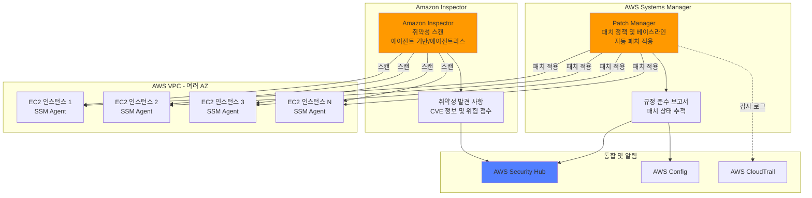
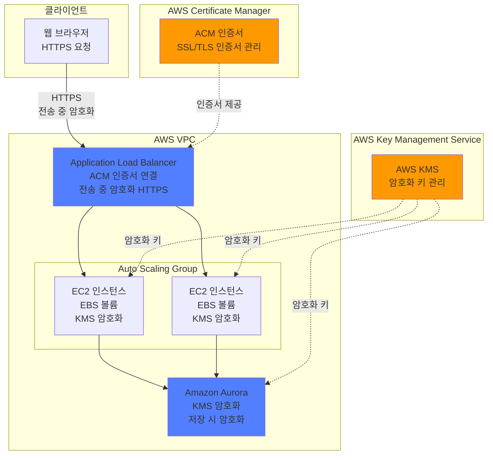

```mermaid
graph TB
    subgraph "온프레미스 데이터센터"
        GameApp[게임 애플리케이션 서버<br/>Lustre 클라이언트]
    end

    subgraph "AWS 연결"
        DX[AWS Direct Connect<br/>또는 VPN]
    end

    subgraph "AWS VPC"
        FSxLustre[Amazon FSx for Lustre<br/>완전 관리형 파일 시스템]
    end

    GameApp -->|Lustre 프로토콜| DX
    DX --> FSxLustre

    style FSxLustre fill:#FF9900
    style GameApp fill:#232F3E
    style DX fill:#527FFF
```

```mermaid
graph TB
    subgraph "공격자"
        Attacker1[악의적 트래픽<br/>수천 개의 IP]
    end

    subgraph "정상 사용자"
        User[정상 사용자]
    end

    subgraph "AWS Shield Advanced"
        Shield[AWS Shield Advanced<br/>DDoS 탐지 및 완화<br/>24/7 DRT 지원]
    end

    subgraph "AWS Global Edge Network"
        CloudFront[Amazon CloudFront<br/>엣지 로케이션 분산<br/>AWS Shield Standard 포함]
    end

    subgraph "AWS VPC"
        ALB[Application Load Balancer]
        ASG[Auto Scaling Group]
        EC2_1[EC2 인스턴스<br/>Windows 웹 서버]
        EC2_2[EC2 인스턴스<br/>Windows 웹 서버]
    end

    Attacker1 -->|DDoS 공격| CloudFront
    User -->|정상 요청| CloudFront
    Shield -.->|보호| CloudFront
    Shield -.->|보호| ALB
    CloudFront -->|필터링된 트래픽| ALB
    ALB --> ASG
    ASG --> EC2_1
    ASG --> EC2_2

    style Shield fill:#FF9900
    style CloudFront fill:#FF9900
    style Attacker1 fill:#D13212
    style User fill:#232F3E
```

```mermaid
graph TB
    subgraph "AWS VPC - 다중 AZ"
        subgraph "Auto Scaling Group"
            EC2_1[EC2 Linux 인스턴스<br/>파일 인덱싱 앱<br/>S3 API 사용]
            EC2_2[EC2 Linux 인스턴스<br/>파일 인덱싱 앱<br/>S3 API 사용]
        end

        RDS[Amazon RDS<br/>인덱스 데이터베이스]
    end

    subgraph "Amazon S3"
        S3Bucket[S3 버킷<br/>Intelligent-Tiering]

        subgraph "자동 계층화"
            Frequent[Frequent Access<br/>자주 액세스]
            Infrequent[Infrequent Access<br/>30일 미액세스<br/>40% 절감]
            Archive[Archive Instant Access<br/>90일 미액세스<br/>68% 절감]
        end
    end

    EC2_1 -->|파일 저장/검색| S3Bucket
    EC2_2 -->|파일 저장/검색| S3Bucket
    EC2_1 -->|인덱스 저장| RDS
    EC2_2 -->|인덱스 저장| RDS

    S3Bucket -.->|자동 이동| Frequent
    Frequent -.->|30일 후| Infrequent
    Infrequent -.->|90일 후| Archive

    style S3Bucket fill:#FF9900
    style Frequent fill:#7AA116
    style Infrequent fill:#527FFF
    style Archive fill:#232F3E
```

# AWS SAA w7 문제 풀이

## 문제 1번

### 문제
한 회사가 온프레미스 데이터 센터에 호스팅된 게임 애플리케이션에 대한 공유 스토리지 솔루션을 구현하고 있습니다. 이 회사는 Lustre 클라이언트를 사용하여 데이터에 액세스할 수 있어야 합니다. 솔루션은 완전히 관리되어야 합니다.

어떤 솔루션이 이러한 요구 사항을 충족합니까?

**A.** AWS Storage Gateway 파일 게이트웨이를 만듭니다. 필요한 클라이언트 프로토콜을 사용하는 파일 공유를 만듭니다. 애플리케이션 서버를 파일 공유에 연결합니다.

**B.** Amazon EC2 Windows 인스턴스를 만듭니다. 인스턴스에 Windows 파일 공유 역할을 설치하고 구성합니다. 애플리케이션 서버를 파일 공유에 연결합니다.

**C.** Amazon Elastic File System(Amazon EFS) 파일 시스템을 만들고 Lustre를 지원하도록 구성합니다. 파일 시스템을 원본 서버에 연결합니다. 애플리케이션 서버를 파일 시스템에 연결합니다.

**D.** Amazon FSx for Lustre 파일 시스템을 만듭니다. 파일 시스템을 원본 서버에 연결합니다. 애플리케이션 서버를 파일 시스템에 연결합니다.

### 정답: D
Amazon FSx for Lustre는 완전 관리형 Lustre 파일 시스템을 제공하며, AWS Direct Connect 또는 VPN을 통해 온프레미스에서 마운트 가능합니다.

### 풀이 근거

- **A. AWS Storage Gateway 파일 게이트웨이**: Storage Gateway 파일 게이트웨이는 SMB 및 NFS 프로토콜만 지원하며, Lustre 클라이언트를 지원하지 않습니다. Lustre는 고성능 병렬 파일 시스템으로 별도의 프로토콜을 사용합니다. → [AWS Storage Gateway File Gateway 공식 문서](https://docs.aws.amazon.com/filegateway/latest/files3/what-is-file-s3.html)

- **B. EC2 Windows 인스턴스에 Windows 파일 공유**: Windows 파일 공유는 SMB 프로토콜을 사용하며 Lustre 클라이언트를 지원하지 않습니다. 또한 EC2 인스턴스에 직접 설치하는 방식은 완전 관리형 솔루션이 아닙니다. → [Amazon FSx for Windows File Server 공식 문서](https://aws.amazon.com/fsx/windows/resources/)

- **C. Amazon EFS를 Lustre로 구성**: Amazon EFS는 NFS v4 프로토콜만 지원하며, Lustre를 지원하도록 구성할 수 없습니다. EFS는 Linux 기반 파일 시스템으로 Lustre와는 완전히 다른 기술입니다. → [Amazon EFS 공식 문서](https://docs.aws.amazon.com/pcs/latest/userguide/working-with_file-systems.html)

- **D. Amazon FSx for Lustre**: ✅ **정답** - Amazon FSx for Lustre는 완전 관리형 Lustre 파일 시스템을 제공합니다. AWS Direct Connect 또는 VPN을 통해 온프레미스 클라이언트에서 마운트할 수 있으며, Lustre 클라이언트를 통해 직접 액세스가 가능합니다. 고성능 컴퓨팅 워크로드에 최적화되어 있으며, 서브 밀리세컨드 지연시간과 수백 GB/s의 처리량을 제공합니다. → [FSx for Lustre 온프레미스 액세스 공식 문서](https://docs.aws.amazon.com/fsx/latest/LustreGuide/fsx-on-premises.html)

### 아키텍처 다이어그램

### 핵심 서비스 요약

**Amazon FSx for Lustre**
- 주요 기능: 완전 관리형 Lustre 파일 시스템, 서브 밀리세컨드 지연시간, 최대 1000 GB/s 처리량, S3와 네이티브 통합
- 사용 사례: 머신러닝, HPC(고성능 컴퓨팅), 비디오 처리, 금융 모델링 등 빠른 스토리지가 필요한 워크로드
- 특징/장점: POSIX 호환, 온프레미스에서 Direct Connect/VPN으로 액세스 가능, Scratch 및 Persistent 배포 옵션 제공
- 제약사항: 파일 시스템 크기 동적 확장 불가(새로운 파일 시스템 생성 및 데이터 복사 필요), 단일 AZ 배포

**AWS Storage Gateway File Gateway**
- 주요 기능: SMB 및 NFS 프로토콜 지원, S3로 파일 저장, 로컬 캐싱으로 낮은 지연시간 액세스
- 사용 사례: 온프레미스에서 S3로 파일 백업, 데이터 레이크 구축, 클라우드 마이그레이션
- 특징/장점: 기존 애플리케이션 변경 없이 사용 가능, S3 수명 주기 정책 활용, 로컬 캐시로 성능 향상
- 제약사항: Lustre 프로토콜 미지원, SMB/NFS만 지원

**Amazon EFS (Elastic File System)**
- 주요 기능: NFS v4 프로토콜 지원, 자동 확장/축소, 다중 AZ 지원, 수천 개의 동시 연결
- 사용 사례: 컨테이너 스토리지, 웹 서빙, 콘텐츠 관리, 빅데이터 분석
- 특징/장점: 서버리스 완전 관리형, 페타바이트 규모 확장, 99.999999999% 내구성
- 제약사항: Lustre 미지원(NFS만 지원), 인스턴스당 최대 500 MB/s 처리량

**Amazon FSx for Windows File Server**
- 주요 기능: SMB 프로토콜 지원, Active Directory 통합, Windows 네이티브 기능(VSS, ACL, DFS)
- 사용 사례: Windows 애플리케이션, 사용자 홈 디렉토리, 부서별 공유 폴더
- 특징/장점: 완전 관리형, Multi-AZ 배포 옵션, SSD/HDD 스토리지 선택
- 제약사항: Lustre 미지원(SMB 전용), Windows 기반 워크로드에만 최적화

### 레퍼런스
- [Amazon FSx for Lustre - 온프레미스 데이터 사용](https://docs.aws.amazon.com/fsx/latest/LustreGuide/fsx-on-premises.html)
- [Amazon FSx for Lustre - 파일 시스템 액세스](https://docs.aws.amazon.com/fsx/latest/LustreGuide/accessing-fs.html)
- [Amazon FSx for Lustre란 무엇인가?](https://docs.aws.amazon.com/fsx/latest/LustreGuide/what-is.html)
- [AWS Storage Gateway File Gateway 개요](https://docs.aws.amazon.com/filegateway/latest/files3/what-is-file-s3.html)
- [Amazon FSx 파일 시스템 선택 가이드](https://aws.amazon.com/fsx/when-to-choose-fsx/)

---

## 문제 2번

### 문제
솔루션 아키텍트는 웹사이트를 위한 고가용성 인프라를 설계해야 합니다. 웹사이트는 Amazon EC2 인스턴스에서 실행되는 Windows 웹 서버로 구동됩니다.

솔루션 아키텍트는 수천 개의 IP 주소에서 발생하는 대규모 DDoS 공격을 완화할 수 있는 솔루션을 구현해야 합니다. 웹사이트에 다운타임은 허용되지 않습니다.

솔루션 아키텍트는 이러한 공격으로부터 웹사이트를 보호하기 위해 어떤 조치를 취해야 합니까? (두 가지를 선택하세요.)

**A.** AWS Shield Advanced를 사용하여 DDoS 공격을 차단하세요.

**B.** Amazon GuardDuty를 구성하여 공격자를 자동으로 차단합니다.

**C.** 정적 및 동적 콘텐츠 모두에 Amazon CloudFront를 사용하도록 웹사이트를 구성합니다.

**D.** AWS Lambda 함수를 사용하여 공격자 IP 주소를 VPC 네트워크 ACL에 자동으로 추가합니다.

**E.** 대상 추적 확장 정책이 CPU 사용률 80%로 설정된 자동 확장 그룹에서 EC2 스팟 인스턴스를 사용합니다.

### 정답: A, C
- **A**: AWS Shield Advanced는 정교한 DDoS 공격에 대한 관리형 보호 제공
- **C**: CloudFront는 엣지 로케이션에서 DDoS 공격을 분산 및 완화

### 풀이 근거

- **A. AWS Shield Advanced 사용**: ✅ **정답** - AWS Shield Advanced는 대규모 DDoS 공격에 대한 고급 보호를 제공합니다. 애플리케이션 트래픽 패턴 기반 맞춤형 탐지, 자동 애플리케이션 계층 DDoS 완화, 24/7 DDoS Response Team(DRT) 지원, DDoS 비용 보호를 포함합니다. 수천 개의 IP에서 발생하는 대규모 공격을 효과적으로 차단할 수 있습니다. → [AWS Shield Advanced 공식 문서](https://aws.amazon.com/shield/features/)

- **B. Amazon GuardDuty로 자동 차단**: Amazon GuardDuty는 위협 탐지 서비스로, 악의적 활동과 무단 행위를 모니터링하고 찾아내는 역할을 합니다. 탐지 결과를 제공하지만 자동으로 공격자를 차단하는 기능은 없습니다. 차단 기능을 구현하려면 추가 자동화(EventBridge + Lambda 등)가 필요하며, DDoS 공격의 빠른 특성상 실시간 대응에는 부적합합니다. → [Amazon GuardDuty 공식 문서](https://aws.amazon.com/guardduty/features/)

- **C. Amazon CloudFront 사용**: ✅ **정답** - CloudFront는 전 세계 엣지 로케이션에 분산된 AWS Global Edge Network를 활용하여 DDoS 공격을 흡수하고 완화합니다. AWS Shield Standard가 무료로 포함되어 있으며, Stateless SYN flood 완화, 자동 트래픽 엔지니어링, 콘텐츠 캐싱을 통한 오리진 보호 기능을 제공합니다. 정적 및 동적 콘텐츠 모두 지원하여 웹사이트 전체를 보호할 수 있습니다. → [CloudFront DDoS 완화 공식 문서](https://docs.aws.amazon.com/whitepapers/latest/secure-content-delivery-amazon-cloudfront/resilience-and-availability.html)

- **D. Lambda로 네트워크 ACL 자동 업데이트**: 수천 개의 IP 주소에서 발생하는 대규모 DDoS 공격의 경우, Lambda 함수를 통한 반응형 차단은 너무 느립니다. 네트워크 ACL에는 엔트리 제한(200개)이 있으며, IP 주소가 계속 변경되는 분산 공격에는 효과적이지 않습니다. 또한 다운타임 없이 실시간으로 대응하기에는 부적합합니다. → [AWS DDoS Best Practices 공식 문서](https://docs.aws.amazon.com/whitepapers/latest/aws-best-practices-ddos-resiliency/mitigation-techniques.html)

- **E. Auto Scaling과 Spot 인스턴스**: Auto Scaling은 일부 DDoS 공격의 영향을 완화할 수 있지만, 수천 개의 IP에서 발생하는 대규모 공격에는 불충분합니다. Spot 인스턴스는 중단될 수 있어 고가용성 요구사항을 충족하지 못하며, 비용만 증가시킵니다. DDoS 공격의 근본적인 해결책이 아니라 증상을 완화하는 방법일 뿐입니다. → [AWS DDoS 완화 기술 공식 문서](https://docs.aws.amazon.com/whitepapers/latest/security-at-the-edge/ddos-mitigation.html)

### 아키텍처 다이어그램

### 핵심 서비스 요약

**AWS Shield Advanced**
- 주요 기능: 관리형 DDoS 보호, 애플리케이션 트래픽 패턴 기반 맞춤형 탐지, 자동 L7 DDoS 완화, 24/7 DRT(DDoS Response Team) 지원
- 사용 사례: 미션 크리티컬 애플리케이션, 대규모 DDoS 공격 대응, 고가용성 요구 웹사이트
- 특징/장점: DDoS 비용 보호, 실시간 공격 알림, 헬스 기반 탐지, 중앙 집중식 보호 관리
- 제약사항: 추가 비용 발생, Shield Standard에 비해 복잡한 설정

**Amazon CloudFront**
- 주요 기능: 글로벌 CDN, 콘텐츠 캐싱, AWS Shield Standard 무료 포함, WAF 통합 지원
- 사용 사례: 웹사이트 성능 향상, DDoS 공격 방어, 정적/동적 콘텐츠 전송, 미디어 스트리밍
- 특징/장점: 엣지 로케이션에서 트래픽 분산, Stateless SYN flood 완화, 오리진 서버 부하 감소, 느린 읽기/쓰기 공격 방어
- 제약사항: 캐시 무효화 비용, 설정 변경 전파 시간 소요

**Amazon GuardDuty**
- 주요 기능: 위협 탐지 서비스, ML 기반 이상 탐지, CloudTrail/VPC Flow Logs/DNS 로그 분석
- 사용 사례: 악의적 활동 모니터링, 무단 행위 탐지, 보안 이벤트 조사
- 특징/장점: 자동화된 위협 탐지, Security Hub/EventBridge 통합, 멀티 계정 지원
- 제약사항: 탐지만 제공(차단 기능 없음), 자동 대응은 추가 구성 필요, 실시간 차단에는 부적합

**AWS Network ACL**
- 주요 기능: 서브넷 수준 방화벽, 상태 비저장 필터링, Inbound/Outbound 규칙
- 사용 사례: 서브넷 수준 트래픽 제어, IP 범위 차단, 기본 네트워크 보안
- 특징/장점: 서브넷 수준 보호, 빠른 규칙 처리
- 제약사항: 규칙 수 제한(200개), 상태 비저장(양방향 규칙 필요), 대규모 IP 차단에 비효율적

**Amazon EC2 Auto Scaling**
- 주요 기능: 자동 용량 조정, 대상 추적/단계별/예약 스케일링 정책, 헬스 체크
- 사용 사례: 트래픽 변동 대응, 고가용성 보장, 비용 최적화
- 특징/장점: 자동 확장/축소, 여러 AZ에 분산, ELB 통합
- 제약사항: DDoS 공격의 근본 해결책 아님, Spot 인스턴스는 중단 가능성

### 레퍼런스
- [AWS Shield Advanced 기능](https://aws.amazon.com/shield/features/)
- [자동 애플리케이션 계층 DDoS 완화](https://docs.aws.amazon.com/whitepapers/latest/aws-best-practices-ddos-resiliency/automatically-mitigate-application-layer-ddos-events-bp1-bp2-bp6.html)
- [CloudFront를 통한 안전한 콘텐츠 전송 - DDoS 복원력](https://docs.aws.amazon.com/whitepapers/latest/secure-content-delivery-amazon-cloudfront/resilience-and-availability.html)
- [AWS DDoS 복원력 모범 사례 - 완화 기술](https://docs.aws.amazon.com/whitepapers/latest/aws-best-practices-ddos-resiliency/mitigation-techniques.html)
- [Amazon GuardDuty 기능](https://aws.amazon.com/guardduty/features/)

---

## 문제 3번

### 문제
보안 감사에서 Amazon EC2 인스턴스가 정기적으로 패치되지 않는다는 사실이 밝혀졌습니다. 솔루션 아키텍트는 대규모 EC2 인스턴스에서 정기적인 보안 검사를 실행하는 솔루션을 제공해야 합니다.

솔루션은 또한 정기적으로 EC2 인스턴스에 패치를 적용하고 각 인스턴스의 패치 상태 보고서를 제공해야 합니다.

어떤 솔루션이 이러한 요구 사항을 충족할까요?

**A.** Amazon Macie를 설정하여 EC2 인스턴스의 소프트웨어 취약성을 스캔합니다. 각 EC2 인스턴스에 cron 작업을 설정하여 정기적으로 인스턴스에 패치를 적용합니다.

**B.** 계정에서 Amazon GuardDuty를 켭니다. GuardDuty를 구성하여 EC2 인스턴스의 소프트웨어 취약성을 검사합니다. AWS Systems Manager Session Manager를 설정하여 정기적으로 EC2 인스턴스에 패치를 적용합니다.

**C.** Amazon Detective를 설정하여 EC2 인스턴스의 소프트웨어 취약성을 검사합니다. Amazon EventBridge 예약 규칙을 설정하여 EC2 인스턴스를 정기적으로 패치합니다.

**D.** 계정에서 Amazon Inspector를 켭니다. Amazon Inspector를 구성하여 EC2 인스턴스의 소프트웨어 취약성을 검사합니다. AWS Systems Manager Patch Manager를 설정하여 정기적으로 EC2 인스턴스에 패치를 적용합니다.

### 정답: D
Amazon Inspector는 EC2 인스턴스의 소프트웨어 취약성을 스캔하고, AWS Systems Manager Patch Manager는 패치를 자동화하고 규정 준수 보고서를 제공합니다.

### 풀이 근거

- **A. Amazon Macie + cron 작업**: Amazon Macie는 S3 버킷에서 민감한 데이터(PII 등)를 탐지하는 데이터 보안 서비스입니다. EC2 인스턴스의 소프트웨어 취약성 스캔 기능은 없습니다. 또한 각 인스턴스에 개별적으로 cron 작업을 설정하는 것은 대규모 환경에서 관리가 어렵고, 중앙 집중식 패치 상태 보고서를 제공하지 않습니다. → [Amazon Macie 공식 문서](https://aws.amazon.com/macie/features/)

- **B. Amazon GuardDuty + Session Manager**: Amazon GuardDuty는 악의적 활동과 무단 행위를 탐지하는 위협 탐지 서비스로, 소프트웨어 취약성 스캔 기능은 없습니다. AWS Systems Manager Session Manager는 인스턴스에 안전하게 접속하기 위한 도구이지 패치 관리 솔루션이 아닙니다. 정기적인 패치 적용이나 규정 준수 보고 기능을 제공하지 않습니다. → [Amazon GuardDuty 공식 문서](https://aws.amazon.com/guardduty/features/)

- **C. Amazon Detective + EventBridge**: Amazon Detective는 보안 조사를 위한 분석 서비스로, 보안 이벤트의 근본 원인을 찾는 데 사용됩니다. EC2 인스턴스의 소프트웨어 취약성 스캔 기능은 없습니다. EventBridge는 이벤트 기반 자동화는 가능하지만, 패치 관리에 특화된 기능이 없어 복잡한 커스텀 구현이 필요합니다. → [Amazon Inspector 취약성 관리 공식 문서](https://docs.aws.amazon.com/prescriptive-guidance/latest/vulnerability-management/amazon-inspector.html)

- **D. Amazon Inspector + Patch Manager**: ✅ **정답** - Amazon Inspector는 EC2 인스턴스를 지속적으로 스캔하여 소프트웨어 취약성과 의도하지 않은 네트워크 노출을 탐지합니다. 에이전트 기반 및 에이전트리스 스캔을 모두 지원하며, CVE 정보와 위험 점수를 제공합니다. AWS Systems Manager Patch Manager는 패치 프로세스를 자동화하고, 패치 정책 설정, 패치 베이스라인 정의, 규정 준수 보고서 생성 기능을 제공합니다. Security Hub, CloudTrail, AWS Config와 통합되어 중앙 집중식 관리가 가능합니다. → [Amazon Inspector EC2 스캔 공식 문서](https://docs.aws.amazon.com/inspector/latest/user/scanning-ec2.html), [AWS Systems Manager Patch Manager 공식 문서](https://docs.aws.amazon.com/systems-manager/latest/userguide/patch-manager.html)

### 아키텍처 다이어그램

### 핵심 서비스 요약

**Amazon Inspector**
- 주요 기능: EC2/컨테이너/Lambda의 소프트웨어 취약성 스캔, 에이전트 기반 및 에이전트리스 스캔, CVE 기반 위험 점수 산출
- 사용 사례: 지속적인 취약성 관리, 보안 감사 준수, 패치 우선순위 결정, 컨테이너 이미지 보안
- 특징/장점: 자동 리소스 검색, Security Hub 통합, 네트워크 접근성 기반 위험 평가, 상세한 수정 권장사항
- 제약사항: 패치 적용 기능 없음(탐지만 제공), 지원되는 OS 제한

**AWS Systems Manager Patch Manager**
- 주요 기능: 패치 자동화, 패치 정책 및 베이스라인 관리, 규정 준수 보고, 다중 계정/리전 지원
- 사용 사례: OS 및 애플리케이션 패치 자동화, 규정 준수 관리, 취약성 해결, 패치 일정 관리
- 특징/장점: 중앙 집중식 제어, 크로스 플랫폼 지원(Windows/Linux), 유연한 스케줄링, Security Hub/Config 통합
- 제약사항: SSM Agent 필요, 인터넷 또는 VPC 엔드포인트 연결 필요, 패치 테스트는 별도로 수행 필요

**Amazon Macie**
- 주요 기능: S3에서 민감한 데이터 탐지, ML 및 패턴 매칭, PII 식별, S3 보안 태세 평가
- 사용 사례: 데이터 프라이버시 규정 준수, 민감 데이터 검색, 데이터 분류, 보안 감사
- 특징/장점: 관리형 데이터 식별자, 커스텀 식별자 지원, EventBridge/Security Hub 통합
- 제약사항: EC2 취약성 스캔 미지원(S3 전용), S3 버킷만 스캔 가능

**Amazon GuardDuty**
- 주요 기능: 위협 탐지, ML 기반 이상 탐지, CloudTrail/VPC Flow Logs/DNS 로그 분석
- 사용 사례: 악의적 활동 탐지, 무단 행위 모니터링, 침해 지표 식별, 보안 인시던트 대응
- 특징/장점: 자동화된 위협 인텔리전스, 지속적인 모니터링, 멀티 소스 분석
- 제약사항: 소프트웨어 취약성 스캔 미지원(위협 탐지 전용), 탐지만 제공(차단 기능 없음)

**Amazon Detective**
- 주요 기능: 보안 조사 및 분석, 근본 원인 분석, 시각화 그래프, 로그 데이터 집계
- 사용 사례: 보안 이벤트 조사, 의심스러운 활동 분석, 사고 대응 지원
- 특징/장점: GuardDuty/Security Hub 통합, 자동 데이터 수집, 시계열 분석
- 제약사항: 취약성 스캔 미지원(조사 도구), 능동적 스캔 기능 없음

### 레퍼런스
- [Amazon Inspector - EC2 인스턴스 스캔](https://docs.aws.amazon.com/inspector/latest/user/scanning-ec2.html)
- [Amazon Inspector 기능](https://aws.amazon.com/inspector/features/)
- [AWS Systems Manager Patch Manager](https://docs.aws.amazon.com/systems-manager/latest/userguide/patch-manager.html)
- [AWS Systems Manager - 패치 관리 모범 사례](https://docs.aws.amazon.com/whitepapers/latest/aws-caf-operations-perspective/patch-management.html)
- [취약성 관리 프로그램에서 Amazon Inspector 사용](https://docs.aws.amazon.com/prescriptive-guidance/latest/vulnerability-management/amazon-inspector.html)

---

## 문제 4번

### 문제
한 회사가 새로운 웹 기반 고객 관계 관리 애플리케이션을 구축하고 있습니다. 이 애플리케이션은 Application Load Balancer(ALB) 뒤에 있는 Amazon Elastic Block Store(Amazon EBS) 볼륨으로 백업된 여러 Amazon EC2 인스턴스를 사용합니다.

이 애플리케이션은 또한 Amazon Aurora 데이터베이스를 사용합니다. 애플리케이션의 모든 데이터는 저장 시와 전송 시 암호화되어야 합니다.

어떤 솔루션이 이러한 요구 사항을 충족할까요?

**A.** ALB에서 AWS Key Management Service(AWS KMS) 인증서를 사용하여 전송 중인 데이터를 암호화합니다. AWS Certificate Manager(ACM)를 사용하여 EBS 볼륨과 Aurora 데이터베이스 저장소를 휴면 상태로 암호화합니다.

**B.** AWS 루트 계정을 사용하여 AWS Management Console에 로그인합니다. 회사의 암호화 인증서를 업로드합니다. 루트 계정에서 계정의 모든 저장 및 전송 중인 데이터에 대한 암호화를 켜는 옵션을 선택합니다.

**C.** AWS Key Management Service(AWS KMS)를 사용하여 EBS 볼륨과 Aurora 데이터베이스 저장소를 휴면 상태로 암호화합니다. AWS Certificate Manager(ACM) 인증서를 ALB에 연결하여 전송 중인 데이터를 암호화합니다.

**D.** BitLocker를 사용하여 모든 휴면 데이터를 암호화합니다. 회사의 TLS 인증서 키를 AWS Key Management Service(AWS KMS)로 가져옵니다. KMS 키를 ALB에 연결하여 전송 중인 데이터를 암호화합니다.

### 정답: C
AWS KMS는 EBS와 Aurora의 저장 시 암호화를 처리하고, ACM 인증서를 ALB에 연결하여 HTTPS를 통한 전송 중 데이터를 암호화합니다.

### 풀이 근거

- **A. ALB에서 KMS 인증서 사용 + ACM으로 스토리지 암호화**: AWS KMS는 암호화 키 관리 서비스이지 인증서 관리 서비스가 아닙니다. ALB는 SSL/TLS 인증서만 지원하며, KMS 인증서를 직접 사용할 수 없습니다. 또한 ACM은 인증서 관리 서비스이지 스토리지 암호화 서비스가 아닙니다. EBS와 Aurora의 저장 시 암호화에는 AWS KMS를 사용해야 합니다. → [AWS KMS 기능](https://aws.amazon.com/kms/features/)

- **B. 루트 계정으로 전체 암호화 활성화**: AWS에는 루트 계정에서 계정의 모든 암호화를 한 번에 활성화하는 옵션이 존재하지 않습니다. 각 서비스마다 개별적으로 암호화를 설정해야 합니다. 또한 루트 계정 사용은 보안 모범 사례에 어긋나며, IAM 사용자/역할을 사용해야 합니다. 이러한 "마스터 스위치" 방식은 AWS의 세분화된 보안 모델과 맞지 않습니다. → [AWS 암호화 모범 사례](https://docs.aws.amazon.com/prescriptive-guidance/latest/aws-kms-best-practices/data-protection-encryption.html)

- **C. AWS KMS + ACM 인증서**: ✅ **정답** - AWS KMS는 EBS 볼륨과 Aurora 데이터베이스의 저장 시 암호화를 위한 암호화 키를 관리합니다. EBS는 KMS 키를 사용한 볼륨 암호화를 지원하고, Aurora는 KMS를 사용한 데이터베이스 암호화를 지원합니다. AWS Certificate Manager(ACM)는 SSL/TLS 인증서를 관리하며, ALB에 인증서를 연결하여 HTTPS를 통한 전송 중 데이터 암호화를 제공합니다. 두 서비스가 각각의 역할을 올바르게 수행합니다. → [AWS KMS와 Aurora 통합](https://docs.aws.amazon.com/AmazonRDS/latest/AuroraUserGuide/Overview.Encryption.Keys.html), [ACM과 ELB 통합](https://docs.aws.amazon.com/acm/latest/userguide/acm-services.html)

- **D. BitLocker + KMS로 TLS 인증서 가져오기**: BitLocker는 Windows OS 수준의 디스크 암호화 도구로, AWS 환경에서 관리형 솔루션이 아닙니다. EC2에서 사용 가능하지만, Aurora 데이터베이스에는 적용할 수 없습니다. 또한 KMS 키를 ALB에 직접 연결할 수 없으며, ALB는 ACM 또는 IAM에서 관리하는 SSL/TLS 인증서만 사용합니다. KMS는 인증서 배포가 아닌 암호화 키 관리를 위한 서비스입니다. → [ELB SSL/TLS 인증서](https://docs.aws.amazon.com/elasticloadbalancing/latest/classic/ssl-server-cert.html)

### 아키텍처 다이어그램

### 핵심 서비스 요약

**AWS Key Management Service (KMS)**
- 주요 기능: 암호화 키 생성 및 관리, 봉투 암호화(Envelope Encryption), 키 정책 및 액세스 제어, 키 회전
- 사용 사례: 저장 시 데이터 암호화(EBS, RDS, S3 등), 애플리케이션 레벨 암호화, 규정 준수 요구사항 충족
- 특징/장점: HSM 기반 키 보호, CloudTrail 감사 로깅, 다양한 AWS 서비스와 통합, FIPS 140-2 검증
- 제약사항: 인증서 관리 미지원, 키 정책 크기 제한(32KB), 지역별 키 관리

**AWS Certificate Manager (ACM)**
- 주요 기능: SSL/TLS 인증서 프로비저닝 및 관리, 자동 갱신, ELB/CloudFront 통합, 무료 퍼블릭 인증서
- 사용 사례: HTTPS 웹사이트, API Gateway 커스텀 도메인, CloudFront 배포, ALB/NLB HTTPS 리스너
- 특징/장점: 인증서 자동 갱신, 무료 퍼블릭 인증서, 관리 오버헤드 감소, 와일드카드 인증서 지원
- 제약사항: EC2 인스턴스에 직접 설치 불가(ELB/CloudFront 등만 지원), 프라이빗 인증서는 별도 비용

**Amazon Aurora**
- 주요 기능: MySQL/PostgreSQL 호환, 자동 스토리지 확장(128TB), 최대 15개 읽기 전용 복제본, 자동 백업
- 사용 사례: 고성능 트랜잭션 애플리케이션, OLTP 워크로드, SaaS 애플리케이션, 엔터프라이즈 앱
- 특징/장점: 표준 MySQL/PostgreSQL 대비 5배/3배 성능, 멀티 AZ 자동 장애 조치, 저장 시 암호화(KMS), 백트랙 기능
- 제약사항: 특정 리전에서만 사용 가능, 스토리지 최소 10GB부터 시작, OS 레벨 암호화 도구(BitLocker) 사용 불가

**Amazon EBS (Elastic Block Store)**
- 주요 기능: 블록 스토리지, 다양한 볼륨 타입(gp3, io2, st1, sc1), 스냅샷 및 백업, KMS 암호화
- 사용 사례: EC2 인스턴스 부트 볼륨, 데이터베이스 스토리지, 고성능 애플리케이션, 로그 저장
- 특징/장점: 저장 시 암호화(KMS 통합), 동적 볼륨 크기 조정, 스냅샷으로 백업, 99.999% 가용성
- 제약사항: 단일 AZ 내에서만 사용, EC2 인스턴스에만 연결 가능, 볼륨 타입별 성능 제한

**Application Load Balancer (ALB)**
- 주요 기능: HTTP/HTTPS 트래픽 로드 밸런싱, 경로 기반/호스트 기반 라우팅, SSL/TLS 종료, ACM 통합
- 사용 사례: 마이크로서비스, 컨테이너 애플리케이션, HTTPS 웹사이트, API 게이트웨이
- 특징/장점: 레이어 7 로드 밸런싱, WebSocket 지원, HTTP/2 지원, 자동 확장
- 제약사항: ACM 또는 IAM 인증서만 지원(KMS 키 직접 연결 불가), TCP/UDP는 NLB 사용 필요

### 레퍼런스
- [AWS KMS 키 관리 - Amazon Aurora](https://docs.aws.amazon.com/AmazonRDS/latest/AuroraUserGuide/Overview.Encryption.Keys.html)
- [AWS KMS 기능](https://aws.amazon.com/kms/features/)
- [ACM과 통합된 AWS 서비스](https://docs.aws.amazon.com/acm/latest/userguide/acm-services.html)
- [Classic Load Balancer의 SSL/TLS 인증서](https://docs.aws.amazon.com/elasticloadbalancing/latest/classic/ssl-server-cert.html)
- [AWS KMS 데이터 보호 및 암호화 모범 사례](https://docs.aws.amazon.com/prescriptive-guidance/latest/aws-kms-best-practices/data-protection-encryption.html)

---

## 문제 5번

### 문제
한 회사가 최근 애플리케이션을 AWS로 마이그레이션했습니다. 이 애플리케이션은 여러 가용성 영역에 걸쳐 Auto Scaling 그룹의 Amazon EC2 Linux 인스턴스에서 실행됩니다.

이 애플리케이션은 EFS Standard-Infrequent Access 스토리지를 사용하는 Amazon Elastic File System(Amazon EFS) 파일 시스템에 데이터를 저장합니다.

이 애플리케이션은 회사의 파일을 인덱싱합니다. 이 인덱스는 Amazon RDS 데이터베이스에 저장됩니다.

이 회사는 일부 애플리케이션과 서비스 변경으로 스토리지 비용을 최적화해야 합니다.

이러한 요구 사항을 가장 비용 효율적으로 충족할 솔루션은 무엇입니까?

**A.** Intelligent-Tiering 수명 주기 정책을 사용하는 Amazon S3 버킷을 만듭니다. 모든 파일을 S3 버킷에 복사합니다. Amazon S3 API를 사용하여 파일을 저장하고 검색하도록 애플리케이션을 업데이트합니다.

**B.** Amazon FSx for Windows File Server 파일 공유를 배포합니다. CIFS 프로토콜을 사용하여 파일을 저장하고 검색하도록 애플리케이션을 업데이트합니다.

**C.** Amazon FSx for OpenZFS 파일 시스템 공유를 배포합니다. 새 마운트 지점을 사용하여 파일을 저장하고 검색하도록 애플리케이션을 업데이트합니다.

**D.** S3 Glacier Flexible Retrieval을 사용하는 Amazon S3 버킷을 만듭니다. 모든 파일을 S3 버킷에 복사합니다. Amazon S3 API를 사용하여 표준 검색으로 파일을 저장하고 검색하도록 애플리케이션을 업데이트합니다.

### 정답: A
S3 Intelligent-Tiering은 액세스 패턴에 따라 자동으로 스토리지 계층을 최적화하여 비용을 절감하며, S3 API를 통해 파일 인덱싱 애플리케이션이 효율적으로 작동할 수 있습니다.

### 풀이 근거

- **A. S3 Intelligent-Tiering 사용**: ✅ **정답** - S3 Intelligent-Tiering은 액세스 패턴을 모니터링하여 자동으로 가장 비용 효율적인 액세스 계층으로 데이터를 이동시킵니다. 30일 동안 액세스되지 않은 객체는 Infrequent Access 계층으로, 90일 동안 액세스되지 않으면 Archive Instant Access 계층으로 이동하여 최대 68%의 비용을 절감합니다. 검색 요금이 없으며, 파일 인덱싱 애플리케이션이 필요할 때 즉시 액세스할 수 있습니다. EFS Standard-IA보다 저렴하며, 애플리케이션을 S3 API로 업데이트하면 더 나은 확장성과 비용 효율성을 얻을 수 있습니다. → [S3 Intelligent-Tiering 공식 문서](https://aws.amazon.com/s3/storage-classes/intelligent-tiering/)

- **B. FSx for Windows File Server 사용**: FSx for Windows File Server는 Windows 기반 워크로드와 SMB 프로토콜에 최적화된 서비스입니다. 현재 애플리케이션은 Linux EC2 인스턴스에서 실행되며, CIFS(SMB) 프로토콜로 전환하는 것은 불필요한 변경입니다. 또한 FSx for Windows는 EFS Standard-IA보다 비용이 더 높을 수 있으며, 비용 최적화 목표에 부합하지 않습니다. → [FSx 선택 가이드](https://aws.amazon.com/fsx/when-to-choose-fsx/)

- **C. FSx for OpenZFS 사용**: FSx for OpenZFS는 ZFS 기반 Linux 파일 서버를 위한 관리형 서비스로, 0.5ms 미만의 낮은 지연시간을 제공하지만 비용이 더 높습니다. 단순히 마운트 지점을 변경하는 것만으로는 스토리지 비용 최적화를 달성하기 어렵습니다. FSx for OpenZFS는 EFS Standard-IA보다 비용 효율적이지 않으며, 파일 인덱싱 워크로드에 필요한 초저지연이 아닌 경우 오버스펙입니다. → [FSx for OpenZFS 가격 및 성능 비교](https://aws.amazon.com/fsx/when-to-choose-fsx/)

- **D. S3 Glacier Flexible Retrieval 사용**: S3 Glacier Flexible Retrieval은 연 1-2회 액세스하는 아카이브 데이터를 위한 스토리지 클래스로, 표준 검색 시 3-5시간이 소요됩니다. 파일 인덱싱 애플리케이션은 파일에 즉시 액세스해야 하므로, 수 시간의 검색 지연은 허용되지 않습니다. 또한 검색 요금이 발생하여 자주 액세스하는 경우 오히려 비용이 증가할 수 있습니다. → [S3 Glacier 검색 옵션](https://docs.aws.amazon.com/AmazonS3/latest/userguide/restoring-objects-retrieval-options.html)

### 아키텍처 다이어그램

### 핵심 서비스 요약

**Amazon S3 Intelligent-Tiering**
- 주요 기능: 자동 계층화, 액세스 패턴 모니터링, 검색 요금 없음, 4개의 액세스 계층(Frequent, Infrequent, Archive Instant, Archive/Deep Archive)
- 사용 사례: 액세스 패턴이 불규칙한 데이터, 장기 스토리지, 데이터 레이크, 백업 및 아카이브, 비용 최적화가 필요한 워크로드
- 특징/장점: 최대 95% 비용 절감, 성능 영향 없음, 운영 오버헤드 없음, 자동 복구(액세스 시 Frequent로 이동)
- 제약사항: 소량의 모니터링 및 자동화 요금, 128KB 미만 객체는 요금만 부과되고 모니터링 안 됨

**Amazon EFS (Elastic File System)**
- 주요 기능: NFS v4 프로토콜, 자동 확장, Standard 및 IA 스토리지 클래스, 다중 AZ 지원
- 사용 사례: 공유 파일 스토리지, 컨테이너 스토리지, 빅데이터 분석, 웹 서빙
- 특징/장점: 완전 관리형, 수천 개의 동시 연결, 페타바이트 확장, 99.999999999% 내구성
- 제약사항: S3보다 비용이 높음(특히 대용량 데이터), NFS 프로토콜만 지원, 지역별 가용성 제한

**Amazon FSx for Windows File Server**
- 주요 기능: SMB 프로토콜, Active Directory 통합, Windows 네이티브 기능, SSD/HDD 스토리지 옵션
- 사용 사례: Windows 애플리케이션, 사용자 홈 디렉토리, SQL Server, SharePoint
- 특징/장점: 완전 관리형, Multi-AZ 배포, 데이터 중복 제거, 자동 백업
- 제약사항: Windows 전용(Linux 앱에는 부적합), S3보다 비용 높음, SMB 프로토콜만 지원

**Amazon FSx for OpenZFS**
- 주요 기능: ZFS 파일 시스템, 0.5ms 미만 지연시간, 스냅샷 및 클론, 데이터 압축
- 사용 사례: 고성능 워크로드, ZFS 마이그레이션, 데이터베이스, 미디어 처리
- 특징/장점: 매우 낮은 지연시간, 최대 21 GB/s 처리량, 인스턴트 클로닝
- 제약사항: EFS보다 비용 높음, 비용 최적화에 적합하지 않음, 단일 AZ 배포

**Amazon S3 Glacier Flexible Retrieval**
- 주요 기능: 아카이브 스토리지, 3가지 검색 옵션(Expedited 1-5분, Standard 3-5시간, Bulk 5-12시간)
- 사용 사례: 연 1-2회 액세스하는 데이터, 장기 백업, 규정 준수 아카이브
- 특징/장점: 매우 낮은 스토리지 비용, 무료 벌크 검색, 높은 내구성
- 제약사항: 즉시 액세스 불가(최소 수 분~수 시간 소요), 검색 요금 발생, 인덱싱 앱에 부적합

### 레퍼런스
- [Amazon S3 Intelligent-Tiering 스토리지 클래스](https://aws.amazon.com/s3/storage-classes/intelligent-tiering/)
- [Amazon S3로 스토리지 비용 절감](https://aws.amazon.com/s3/cost-optimization/)
- [S3 Intelligent-Tiering으로 스토리지 비용 관리](https://docs.aws.amazon.com/AmazonS3/latest/userguide/intelligent-tiering.html)
- [S3 아카이브 검색 옵션 이해](https://docs.aws.amazon.com/AmazonS3/latest/userguide/restoring-objects-retrieval-options.html)
- [Amazon FSx 파일 시스템 선택 가이드](https://aws.amazon.com/fsx/when-to-choose-fsx/)
